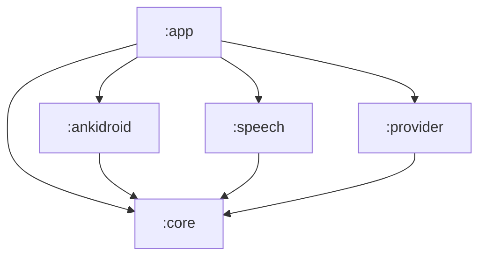

# AnkiVoice for Android

- Issue: [#48 — AV-041: Bootstrap the Android build and port the AV-007 contract types](https://github.com/BrockBadeaux14/AnkiVoice/issues/48).
- Decision: [AV-022: Android implementation](../docs/decisions/0022-android-implementation.md)
  (native Kotlin, one Gradle build, five modules).
- Specification: [AV-007: Integration contracts and review lifecycle](../docs/contracts/av007-session-contracts.md).

This is the Gradle build and the Kotlin copy of the AV-007 contracts that every Android
card builds on. AV-023 (#24) adds the Compose shell, AnkiDroid access preflight and deck
selection, permission onboarding, app-private settings, and a debug sample-session
preview. See the [AV-023 results](../docs/testing/av023/results.md) and
[runbook](../docs/testing/av023/runbook.md). Real card access, speech, network access and
ReviewSession integration belong to #25, #26, #17 and #14.

## Build

Requirements:

- A JDK 17 or newer to run Gradle. The build emits Java 17 bytecode whatever JDK runs it.
- The Android SDK with `platforms;android-36` and `build-tools;36.0.0`. Point
  `ANDROID_HOME` at it, or put `sdk.dir=…` in `android/local.properties`, which is
  gitignored.

```sh
cd android
./gradlew checkModuleBoundaries :core:test assembleDebug
./gradlew :ankidroid:testDebugUnitTest :app:testDebugUnitTest :app:assembleRelease :app:lintDebug
```

On Windows, run `gradlew.bat` with the same arguments.

| Task | What it checks |
| --- | --- |
| `checkModuleBoundaries` | The module graph follows AV-022 (see [Modules](#modules)). It also runs as part of `check`. |
| `:core:test` | The contract-level JVM tests and the Kotlin half of the drift guard. |
| `assembleDebug` | All five modules compile, and `:app` produces `app/build/outputs/apk/debug/app-debug.apk`. |
| `:ankidroid:testDebugUnitTest :app:testDebugUnitTest` | Access classification, deck selection, session cancellation and lifecycle regression tests for AV-023. |
| `:app:assembleRelease :app:lintDebug` | Release compilation without fakes; Android lint. |

[`.github/workflows/android.yml`](../.github/workflows/android.yml) runs both commands on
`ubuntu-24.04` with Temurin 17, for every push and pull request. The
[`VoiceQA fixtures`](../.github/workflows/fixtures.yml) workflow runs the Python half of
the drift guard.

## Pins

Every version is pinned in [`gradle/libs.versions.toml`](gradle/libs.versions.toml),
except the Gradle wrapper, which is pinned in
[`gradle/wrapper/gradle-wrapper.properties`](gradle/wrapper/gradle-wrapper.properties).

<!-- av041:pins:begin -->

| Pin | Value | Source |
| --- | --- | --- |
| Gradle wrapper | `9.3.1`, `all` distribution, SHA-256 `17f277867f6914d61b1aa02efab1ba7bb439ad652ca485cd8ca6842fccec6e43` | AV-022 baseline |
| Android Gradle plugin | `9.1.0` | AV-022 baseline |
| Compile SDK | `36` | AV-022 baseline |
| Target SDK | `35` | AV-022 baseline |
| Minimum SDK | `33` | AV-022 baseline (install floor, not a support claim) |
| Build tools | `36.0.0` | AV-022 baseline |
| Bytecode | Java `17` | AV-022 baseline |
| Kotlin | `2.4.20`: the Kotlin JVM plugin, the Compose compiler plugin and `kotlin-reflect` (tests only) | AV-041 |
| Compose BOM | `2026.06.01`, which resolves Compose `1.11.4` and supplies `material3` | AV-041 |
| AndroidX Activity | `androidx.activity:activity-compose` `1.13.0` | AV-041 |
| JUnit | `6.1.3`, through `org.junit:junit-bom` (Jupiter and the platform launcher) | AV-041, tests only |

<!-- av041:pins:end -->

Why these AV-041 pins:

- **Kotlin 2.4.20** was the newest stable Kotlin when this was pinned. AGP 9's built-in
  Kotlin support compiles the Android modules with the Kotlin Gradle plugin on the root
  classpath, so this one version covers `:core`, the Android modules and the Compose
  compiler.
- **Compose BOM 2026.06.01** is the newest BOM that compiles against SDK 36. BOMs from
  `2026.08.00` onward resolve Compose 1.12, whose AAR metadata requires compile SDK 37.
  AGP 9.1.0 recommends 36 as its maximum, and moving compile SDK is outside AV-022's
  baseline. `checkDebugAarMetadata` fails with the newer BOM.
- **Activity 1.13.0** was the newest stable `activity-compose`, and it compiles against
  SDK 36.

Build JDK: the validation below ran Gradle on Android Studio's JBR 25.0.2, the JDK in
AV-022's baseline. CI runs it on Temurin 17.

## Modules



| Module | Kind | Contents now | Owner of what comes next |
| --- | --- | --- | --- |
| `:core` | Kotlin/JVM, no Android plugin or dependency | The AV-007 contract port in `org.ankivoice.core.contracts`; the fakes in its `testFixtures` source set | #14, #13, #25, #16/#18, #15, #20 |
| `:ankidroid` | Android library | Access preflight; `decks` reads and verified `selected_deck` updates | #25, #10 |
| `:speech` | Android library | A marker object; no platform calls | #26 |
| `:provider` | Android library | A marker object; no platform calls or network access | #17, #18 |
| `:app` | Android application | Single-activity shell, onboarding, private settings, lifecycle delivery and debug sample session | #27, #17 |

`checkModuleBoundaries` fails the build when:

- a module depends on a project AV-022 does not allow;
- `:app` stops depending on all four other modules;
- `:core` applies an Android plugin or declares an `android*`, `androidx*` or
  `com.google.android*` dependency;
- a feature variant of `:core`, such as its test fixtures, is added to a configuration
  that a release build can see.

### The fakes

The in-memory fakes live in `core/src/testFixtures`, so they reach JVM tests and debug
builds only:

```kotlin
testImplementation(testFixtures(project(":core")))  // in :core this is automatic
debugImplementation(testFixtures(project(":core")))  // what :app declares
```

`:app` proves both sides. Its `src/debug` composition root reads the demo collection from
the fakes. Its `src/release` counterpart supplies no card provider: study is unavailable
while onboarding and deck selection remain usable. The release APK contains no
`org.ankivoice.core.fakes` classes.

## The contract port

`:core` ports the part of [`tools/av007_contracts.py`](../tools/av007_contracts.py)
before `GuardedReviewWriter`, and all of [`tools/av007_fakes.py`](../tools/av007_fakes.py)
except `FakeReviewWriter`. The Python binding is unchanged and stays the executable
reference.

| Python | Kotlin (`org.ankivoice.core.contracts`) |
| --- | --- |
| `CardIdentity`, `CardState`, `VoiceQAFields`, `ScheduledCard`, `QueueExhausted`, `VOICEQA_MODEL` | Same names. `QueueExhausted` is a `data object`. |
| `Capabilities` | `Capabilities`, with the same defaults. A negative cap throws `IllegalArgumentException`. |
| Five `*Failure` enums, `ALL_FAILURE_MODES`, `Failure` | Five enums under `sealed interface FailureMode`, plus `Contract`, `failureModes(contract)`, `ALL_FAILURE_MODES` and `Failure`. |
| `ScheduledCard \| QueueExhausted \| Failure` and the other unions | The sealed results `CapabilitiesResult`, `NextCardResult` (which includes `ReadCardResult`) and `GradingOutcome`. |
| `Utterance`, `UtterancePurpose`, `GradingContext` and their builders | Same names: `questionUtterance`, `revealUtterance`, `elaborationUtterance`, `gradingContext`, `cardLanguage`. |
| `GradeLabel`, `AUTOMATIC_PROPOSALS`, `GradingResult.proposed_rating` | `GradeLabel.automaticProposal`, an exhaustive `when`, and `GradingResult.proposedRating`. |
| `OperationToken`, `TranscriptKind`, `Confidence`, `CaptureEvent`, `PlaybackResult`, `GradingRequest`, `GradingReply`, `ConfirmationSource`, `RatingConfirmation` | Same names. `CaptureEvent` and `PlaybackResult` are sealed. |
| `ReviewState`, `TERMINAL_REVIEW_STATES`, `ReviewIntent`, `RawAcknowledgement`, `ReviewOutcome` | Same names. `ReviewState.isTerminal`; `RawAcknowledgement` is sealed. |
| `CardProvider`, `SpeechOutput`, `SpeechInput`, `Grader`, `ReviewTransport`, `ReviewWriter` | Interfaces with the same operations. |
| `MonotonicClock` | `fun interface MonotonicClock`, plus `SystemMonotonicClock` backed by `System.nanoTime`. |
| `tools/av007_fakes.py` | `org.ankivoice.core.fakes`: `FakeClock`, `FakeCollection`, `StoredCard`, `RecordedReview`, `FakeCardProvider`, `WriteAnomaly`, `FakeReviewTransport`, `FakeSpeechOutput`, `FakeSpeechInput`, `FakeGrader`, `demoCard` and `demoCollection`. |

Left for later cards: `is_one_review_transition`, `GuardedReviewWriter` and
`FakeReviewWriter` go to #25. `ReviewSession`, `SessionState`, `Halt`, `Event`,
`Interruption`, `transcript()` and the 53 scenarios go to #14.

### Representation choices

These keep the specification's meaning while using Kotlin types:

- **Every operation result is exhaustively matchable.** Where Python returns a union, or a
  value with an optional failure, Kotlin returns a sealed type:
  - `PlaybackResult` is `Completed` or `Failed`.
  - `CaptureEvent` is `Transcript` or `Failed`.
  - `RawAcknowledgement` is `UpdateCount`, `NullResponse` or `ErrorResponse`.

  The specification says a failure takes precedence over any accompanying text. The
  Python binding can express a capture with both text and a failure; in Kotlin a failed
  capture has no text field at all.
- **Specification spelling.** Enum constants keep the Python member names (`ACCESS_DENIED`),
  and each enum's `specName` is the specification's spelling (`accessDenied`,
  `outcome-unknown`, `learner-corrected`). `Failure.toString()` prints
  `CardProvider.accessDenied: detail` where Python prints `CardProvider.access_denied: detail`.
- **No failure becomes a rating.** `Failure` carries a mode, a detail and a cause, and
  nothing else. `FailureTaxonomyTest` scans every compiled `:core` class. It fails if a
  public method takes a failure, or a result that can hold one, and returns an `Int`.
- **Caller ordering errors** throw `IllegalStateException` where Python raises
  `ValueError`, for example `ReviewIntent.correct` after commit.
- **Units.** IDs, `due`, Unix-second times and milliseconds are `Long`. Ratings, counts,
  ordinals and revisions are `Int`. Tuples become `List`.
- **`ReviewIntent` stays mutable**, as in the binding, because #14 and #25 advance it in
  place. Its `state`, `elapsedMs`, `token`, `confirmation` and `interrupted` setters are
  `internal` to `:core`.
- **Operations are synchronous**, like the binding. AV-022 places each contract but fixes
  no Kotlin method signatures. Delivery across threads, whether by coroutines or
  callbacks, belongs to the cards that implement the transports and the session: #14,
  #25 and #26.
- **The fakes are `open`** so a test can override one call, where the Python tests
  replace a bound method. Script entries are typed (`FakeSpeechInput.Say`, `Fail` and
  `Deliver`, and the equivalents for the other fakes). A `null` provider script entry
  falls through to normal behaviour, like Python's `None`. Stand-in scheduling rounds
  ties to even, as Python's `round()` does, so both fakes produce the same card states.

### Specification and binding discrepancies

Two field names found during the port differ between the specification and the
binding. Both were resolved in favour of the specification. The binding and its tests
are unchanged.

| Where | Specification | Python binding | Kotlin |
| --- | --- | --- | --- |
| `ReviewWriter.commit` input | `ReviewIntent(cardSnapshot, …)` | `ReviewIntent.card` | `ReviewIntent.cardSnapshot` |
| `Grader.grade` input | `GradingRequest(operationToken, …)` | `GradingRequest.token` | `GradingRequest.operationToken` |

One non-semantic difference: the specification's CardProvider failure table lists
`nullCursor` fourth, while the binding declares it last. The Kotlin enum follows the
binding's order, so the drift guard can compare lists in order.

## Drift guard

[`tools/av041_manifest.py`](../tools/av041_manifest.py) derives
[`core/src/test/resources/av007/manifest.txt`](core/src/test/resources/av007/manifest.txt)
from the Python binding. The manifest covers:

- contract names and operations, and the `ReviewTransport` seam;
- the failures under each contract;
- the capability flags and their defaults;
- the review states and which are terminal;
- the grade labels and their proposals.

Each check fails in its own place:

- `tests/test_av041_android.py` fails if the checked-in manifest is stale, or if a
  name is not spelled as the specification spells it.
- `ManifestDriftTest` in `:core` fails if the Kotlin port differs from the manifest.

After an intentional change to `tools/av007_contracts.py`:

```sh
python tools/av041_manifest.py --write
python -m unittest tests.test_av041_android -v
cd android && ./gradlew :core:test
```

## What this does not establish

- AV-041's original validation built the debug APK without launching it. AV-023 now
  records a focused onboarding/deck/session run on the pinned macOS ARM64 AVD in its
  [results](../docs/testing/av023/results.md). Physical-device behavior remains unverified.
- AV-041's original local validation ran on a Windows 11 x86_64 host, not the macOS ARM64 evidence host
  with AV-022's validated pins. A JVM build and its unit tests do not depend on the host.
  Any device or emulator evidence in later cards still needs the pinned host.
- The fakes are not a scheduler. They cannot prove timing, threading or Android lifecycle
  behaviour.
