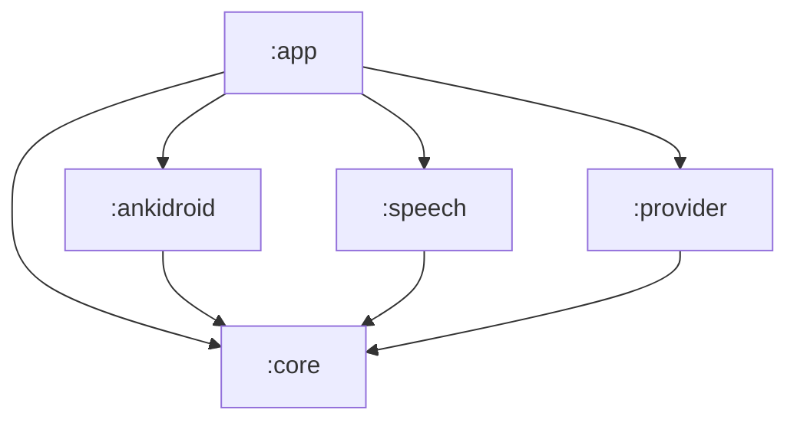

# AnkiVoice for Android

- Issue: [#48 — AV-041: Bootstrap the Android build and port the AV-007 contract types](https://github.com/BrockBadeaux14/AnkiVoice/issues/48).
- Decision: [AV-022: Android implementation](../docs/decisions/0022-android-implementation.md)
  (native Kotlin, one Gradle build, five modules).
- Specification: [AV-007: Integration contracts and review lifecycle](../docs/contracts/av007-session-contracts.md).

This is the Gradle build for the AnkiVoice Android app: the Kotlin port of the AV-007
contracts and the session rules in `:core`, the AnkiDroid, speech and grading-provider
adapters, and the `:app` composition root with its setup screen and study screen. The
sections below record each card's part of it in the order they landed; the study screen a
learner actually uses is described in [The study surface](#the-study-surface). AV-023 (#24)
added the Compose shell, access preflight, deck selection and onboarding — see its
[results](../docs/testing/av023/results.md) and [runbook](../docs/testing/av023/runbook.md) —
and AV-039 (#10) the VoiceQA note type provisioning behind an explicit setup action — see
its [results](../docs/testing/av039/results.md) and [runbook](../docs/testing/av039/runbook.md).

## Build

Requirements:

- A JDK 17 or newer to run Gradle. The build emits Java 17 bytecode whatever JDK runs it.
- The Android SDK with `platforms;android-36` and `build-tools;36.0.0`. Point
  `ANDROID_HOME` at it, or put `sdk.dir=…` in `android/local.properties`, which is
  gitignored.

```sh
cd android
./gradlew checkModuleBoundaries :core:test assembleDebug
./gradlew :ankidroid:testDebugUnitTest :app:testDebugUnitTest :app:assembleRelease :app:lintDebug
```

On Windows, run `gradlew.bat` with the same arguments.

| Task | What it checks |
| --- | --- |
| `checkModuleBoundaries` | The module graph follows AV-022 (see [Modules](#modules)). It also runs as part of `check`. |
| `:core:test` | The contract-level JVM tests and the Kotlin half of the drift guard. |
| `assembleDebug` | All five modules compile, and `:app` produces `app/build/outputs/apk/debug/app-debug.apk`. |
| `:ankidroid:testDebugUnitTest :app:testDebugUnitTest` | AV-023's access classification, deck selection, session cancellation and lifecycle regression tests, and AV-039's provisioning outcomes and note type loader. |
| `:app:assembleRelease :app:lintDebug` | Release compilation without fakes; Android lint. |

[`.github/workflows/android.yml`](../.github/workflows/android.yml) runs both commands on
`ubuntu-24.04` with Temurin 17, for every push and pull request. The
[`VoiceQA fixtures`](../.github/workflows/fixtures.yml) workflow runs the Python half of
the drift guard.

## Pins

Every version is pinned in [`gradle/libs.versions.toml`](gradle/libs.versions.toml),
except the Gradle wrapper, which is pinned in
[`gradle/wrapper/gradle-wrapper.properties`](gradle/wrapper/gradle-wrapper.properties).

<!-- av041:pins:begin -->

| Pin | Value | Source |
| --- | --- | --- |
| Gradle wrapper | `9.3.1`, `all` distribution, SHA-256 `17f277867f6914d61b1aa02efab1ba7bb439ad652ca485cd8ca6842fccec6e43` | AV-022 baseline |
| Android Gradle plugin | `9.1.0` | AV-022 baseline |
| Compile SDK | `36` | AV-022 baseline |
| Target SDK | `35` | AV-022 baseline |
| Minimum SDK | `33` | AV-022 baseline (install floor, not a support claim) |
| Build tools | `36.0.0` | AV-022 baseline |
| Bytecode | Java `17` | AV-022 baseline |
| Kotlin | `2.4.20`: the Kotlin JVM plugin, the Compose compiler plugin and `kotlin-reflect` (tests only) | AV-041 |
| Compose BOM | `2026.06.01`, which resolves Compose `1.11.4` and supplies `material3` | AV-041 |
| AndroidX Activity | `androidx.activity:activity-compose` `1.13.0` | AV-041 |
| JUnit | `6.1.3`, through `org.junit:junit-bom` (Jupiter and the platform launcher) | AV-041, tests only |

<!-- av041:pins:end -->

Why these AV-041 pins:

- **Kotlin 2.4.20** was the newest stable Kotlin when this was pinned. AGP 9's built-in
  Kotlin support compiles the Android modules with the Kotlin Gradle plugin on the root
  classpath, so this one version covers `:core`, the Android modules and the Compose
  compiler.
- **Compose BOM 2026.06.01** is the newest BOM that compiles against SDK 36. BOMs from
  `2026.08.00` onward resolve Compose 1.12, whose AAR metadata requires compile SDK 37.
  AGP 9.1.0 recommends 36 as its maximum, and moving compile SDK is outside AV-022's
  baseline. `checkDebugAarMetadata` fails with the newer BOM.
- **Activity 1.13.0** was the newest stable `activity-compose`, and it compiles against
  SDK 36.

Build JDK: the validation below ran Gradle on Android Studio's JBR 25.0.2, the JDK in
AV-022's baseline. CI runs it on Temurin 17.

## Modules



| Module | Kind | Contents |
| --- | --- | --- |
| `:core` | Kotlin/JVM, no Android plugin or dependency | The AV-007 contract port in `org.ankivoice.core.contracts`; AV-012's answer policy in `org.ankivoice.core.answer`; AV-015's rule-based grading in `org.ankivoice.core.grading`; AV-010's eligibility in `org.ankivoice.core.eligibility`; AV-013's session state machine in `org.ankivoice.core.session`; AV-018's journal port and reconciliation policy in `org.ankivoice.core.journal`; AV-014's command vocabulary and router in `org.ankivoice.core.commands`; AV-019's pre-commit exchange in `org.ankivoice.core.exchange`; the fakes in its `testFixtures` source set |
| `:ankidroid` | Android library | Access preflight; `decks` reads and verified `selected_deck` updates; AV-039 VoiceQA provisioning with read-back; AV-024's card provider, review transport and eligibility traversal |
| `:speech` | Android library | AV-025's speech transport: the pinned TTS/recognizer route, the app-owned microphone pipe, and the ordering, cancellation and failure rules behind both AV-007 speech contracts; AV-044's segment confidence |
| `:provider` | Android library | AV-020's credential store, free-route guard, durable quota ledger, content-free diagnostics and the one HTTPS seam; AV-016's semantic grader; AV-043's paid fallback route and daily budget |
| `:app` | Android application | The setup screen (onboarding, the VoiceQA setup action and its full-sync disclosure, deck selection, AV-020's provider settings, private settings), AV-018's durable journal store, AV-045's composition and reconciliation gate, and AV-026's study screen and its controller |

`checkModuleBoundaries` fails the build when:

- a module depends on a project AV-022 does not allow;
- a module other than `:provider` declares `android.permission.INTERNET`, `:provider`
  stops declaring it, or any module declares `android.permission.READ_PHONE_STATE`;
- `:app` stops depending on all four other modules;
- `:core` applies an Android plugin or declares an `android*`, `androidx*` or
  `com.google.android*` dependency;
- a feature variant of `:core`, such as its test fixtures, is added to a configuration
  that a release build can see.

### The fakes

The in-memory fakes live in `core/src/testFixtures`, so they reach JVM tests and debug
builds only:

```kotlin
testImplementation(testFixtures(project(":core")))  // in :core this is automatic
debugImplementation(testFixtures(project(":core")))  // what :app declares
```

`:app` declares the fixtures for debug builds and JVM tests only, and the release APK
contains no `org.ankivoice.core.fakes` classes. Since AV-024 both build types compose the
real AnkiDroid provider, and no `:app` source set differs between them.

## The contract port

`:core` ports the part of [`tools/av007_contracts.py`](../tools/av007_contracts.py)
before `GuardedReviewWriter`, and all of [`tools/av007_fakes.py`](../tools/av007_fakes.py)
except `FakeReviewWriter`. The Python binding is unchanged and stays the executable
reference.

| Python | Kotlin (`org.ankivoice.core.contracts`) |
| --- | --- |
| `CardIdentity`, `CardState`, `VoiceQAFields`, `ScheduledCard`, `QueueExhausted`, `VOICEQA_MODEL` | Same names. `QueueExhausted` is a `data object`. |
| `Capabilities` | `Capabilities`, with the same defaults. A negative cap throws `IllegalArgumentException`. |
| Five `*Failure` enums, `ALL_FAILURE_MODES`, `Failure` | Five enums under `sealed interface FailureMode`, plus `Contract`, `failureModes(contract)`, `ALL_FAILURE_MODES` and `Failure`. |
| `ScheduledCard \| QueueExhausted \| Failure` and the other unions | The sealed results `CapabilitiesResult`, `NextCardResult` (which includes `ReadCardResult`) and `GradingOutcome`. |
| `Utterance`, `UtterancePurpose`, `GradingContext` and their builders | Same names: `questionUtterance`, `revealUtterance`, `elaborationUtterance`, `gradingContext`, `cardLanguage`. |
| `GradeLabel`, `AUTOMATIC_PROPOSALS`, `GradingResult.proposed_rating` | `GradeLabel.automaticProposal`, an exhaustive `when`, and `GradingResult.proposedRating`. |
| `OperationToken`, `TranscriptKind`, `Confidence`, `CaptureEvent`, `PlaybackResult`, `GradingRequest`, `GradingReply`, `ConfirmationSource`, `RatingConfirmation` | Same names. `CaptureEvent` and `PlaybackResult` are sealed. |
| `ReviewState`, `TERMINAL_REVIEW_STATES`, `ReviewIntent`, `RawAcknowledgement`, `ReviewOutcome` | Same names. `ReviewState.isTerminal`; `RawAcknowledgement` is sealed. |
| `CardProvider`, `SpeechOutput`, `SpeechInput`, `Grader`, `ReviewTransport`, `ReviewWriter` | Interfaces with the same operations. |
| `MonotonicClock` | `fun interface MonotonicClock`, plus `SystemMonotonicClock` backed by `System.nanoTime`. |
| `tools/av007_fakes.py` | `org.ankivoice.core.fakes`: `FakeClock`, `FakeCollection`, `StoredCard`, `RecordedReview`, `FakeCardProvider`, `WriteAnomaly`, `FakeReviewTransport`, `FakeSpeechOutput`, `FakeSpeechInput`, `FakeGrader`, `demoCard` and `demoCollection`. |

Left for later cards: `is_one_review_transition`, `GuardedReviewWriter` and
`FakeReviewWriter` go to #25. `ReviewSession`, `SessionState`, `Halt`, `Event`,
`Interruption`, `transcript()` and the 53 scenarios go to #14.

### Representation choices

These keep the specification's meaning while using Kotlin types:

- **Every operation result is exhaustively matchable.** Where Python returns a union, or a
  value with an optional failure, Kotlin returns a sealed type:
  - `PlaybackResult` is `Completed` or `Failed`.
  - `CaptureEvent` is `Transcript` or `Failed`.
  - `RawAcknowledgement` is `UpdateCount`, `NullResponse` or `ErrorResponse`.

  The specification says a failure takes precedence over any accompanying text. The
  Python binding can express a capture with both text and a failure; in Kotlin a failed
  capture has no text field at all.
- **Specification spelling.** Enum constants keep the Python member names (`ACCESS_DENIED`),
  and each enum's `specName` is the specification's spelling (`accessDenied`,
  `outcome-unknown`, `learner-corrected`). `Failure.toString()` prints
  `CardProvider.accessDenied: detail` where Python prints `CardProvider.access_denied: detail`.
- **No failure becomes a rating.** `Failure` carries a mode, a detail and a cause, and
  nothing else. `FailureTaxonomyTest` scans every compiled `:core` class. It fails if a
  public method takes a failure, or a result that can hold one, and returns an `Int`.
- **Caller ordering errors** throw `IllegalStateException` where Python raises
  `ValueError`, for example `ReviewIntent.correct` after commit.
- **Units.** IDs, `due`, Unix-second times and milliseconds are `Long`. Ratings, counts,
  ordinals and revisions are `Int`. Tuples become `List`.
- **`ReviewIntent` stays mutable**, as in the binding, because #14 and #25 advance it in
  place. Its `state`, `elapsedMs`, `token`, `confirmation` and `interrupted` setters are
  `internal` to `:core`.
- **Operations are synchronous**, like the binding. AV-022 places each contract but fixes
  no Kotlin method signatures. Delivery across threads, whether by coroutines or
  callbacks, belongs to the cards that implement the transports and the session: #14,
  #25 and #26.
- **The fakes are `open`** so a test can override one call, where the Python tests
  replace a bound method. Script entries are typed (`FakeSpeechInput.Say`, `Fail` and
  `Deliver`, and the equivalents for the other fakes). A `null` provider script entry
  falls through to normal behaviour, like Python's `None`. Stand-in scheduling rounds
  ties to even, as Python's `round()` does, so both fakes produce the same card states.

### Specification and binding discrepancies

Two field names found during the port differ between the specification and the
binding. Both were resolved in favour of the specification. The binding and its tests
are unchanged.

| Where | Specification | Python binding | Kotlin |
| --- | --- | --- | --- |
| `ReviewWriter.commit` input | `ReviewIntent(cardSnapshot, …)` | `ReviewIntent.card` | `ReviewIntent.cardSnapshot` |
| `Grader.grade` input | `GradingRequest(operationToken, …)` | `GradingRequest.token` | `GradingRequest.operationToken` |

One non-semantic difference: the specification's CardProvider failure table lists
`nullCursor` fourth, while the binding declares it last. The Kotlin enum follows the
binding's order, so the drift guard can compare lists in order.

## VoiceQA provisioning

`:ankidroid` owns AV-039 (#10). `AnkiDroidProvisioning` installs the VoiceQA note type
when it is missing, reuses it when its ordered field names match the fixture, and stops
with a named conflict when they do not. `:app` supplies the explicit setup action and the
full-sync disclosure; nothing provisions on its own.

| Type | What it is |
| --- | --- |
| `VoiceQaNoteType` | The installable specification: name, ordered fields, CSS, one template, the demo deck and its four sample notes |
| `ProvisioningPlatform` | The resolver seam, extending AV-023's `AccessPlatform` with `models`, `models/<id>/templates`, `decks`, `notes`, `notes/<id>/cards` and the card move |
| `ProvisioningStatus` | `Complete`, `Declined`, `Incomplete(reasons)`, `Conflict(differences)` or `Failed(failure)` |
| `ProvisioningReport` | The status plus how far the run got: a `ProvisioningStep` per item and the number of sample notes added |
| `Provisioner` | `inspect`, which never writes, and `provision(fullSyncAccepted)`, which writes nothing without it |

`AnkiDroidProvisioning` and `AnkiDroidAccess` share one serial worker in `:app`'s
composition root, so a deck read and a collection write never overlap. Provisioning's
only writes are a `models` insert with its template update, a `decks` insert, `notes`
inserts, and a move of the cards that run just created. It reports failures with AV-007's
names: `packageUnavailable`, `apiDisabled`, `accessDenied` and `nullCursor`.

After writing a note type it is read back through `models` and its templates and compared
with the fixture; a mismatch is reported as incomplete, naming what differs. The
[AV-039 results](../docs/testing/av039/results.md) record the confirmed provider route and
the pinned-emulator evidence.
## Answer boundaries and transcript policy

- Issue: [#13 — AV-012: Integrate transcription and answer boundaries](https://github.com/BrockBadeaux14/AnkiVoice/issues/13).
- Evidence: [AV-042 result and implementation handoff](../docs/testing/av042/results.md#implementation-handoff),
  [AV-006 native speech](../docs/decisions/0006-speech-and-grading-providers.md).

`AnswerTurn` in `org.ankivoice.core.answer` is one card's answer policy above #7's
`SpeechInput` contract. It owns *when* capture may run and *what* the transcript
currently is. #26 owns the recognizer, the capture stream, platform callbacks and
cleanup; #14 owns session orchestration; #15/#27 own voice commands. Nothing here plays
audio, reads a card or writes a review, and there is no second speech implementation and
no cloud STT candidate.

The limits are AV-042's selected MVP values plus AV-050's pre-roll. They are engineering
bounds, not optimized or validated recall durations — no measurement says 15 seconds is
long enough to recall an answer, and none says 15 seconds is long enough to say one.

**Amended September 17, 2026 by [AV-050](https://github.com/BrockBadeaux14/AnkiVoice/issues/81).**
The rule used to be that capture opens only on an **explicit Start answer**, which is what
made thinking time unbounded. It is now **the microphone opens itself exactly once per
attempt, after that attempt's prompt playback settles**. The unbounded thinking that the
tap bought is replaced by a pre-roll in front of the window, so the 15 seconds stays an
honest *speaking* budget rather than being spent remembering. Start answer remains a touch
control for a learner who wants to start early and for an automatic open that failed.

| Limit | Value | Rule |
| --- | --- | --- |
| Waiting for the attempt | unbounded | The gap between a card being offered and its prompt playback settling. No budget is consumed; since AV-050 this is the prompt playing rather than a learner deciding when to tap. |
| Pre-roll | 15,000 ms | AV-050. Recall time inside an open microphone, from the open on a monotonic clock. It ends the moment the learner is first heard. |
| Answer window | 5,000 ms | The maximum **speaking** capture, from speech onset — or from the pre-roll running out, when nobody was ever heard. Cut from 15,000 at the owner's direction on September 17, 2026: endpointing normally ends a capture about a second after the learner stops, so this is a backstop rather than a budget anybody spends. An answer that runs past it is stopped by the expiry, which preserves the card and offers Try again. |
| Finalization | 5,000 ms | A separate deadline from Done, an endpoint or window expiry, inclusive of #26's 500 ms of trailing silence. Its expiry is a timeout, not an answer. |
| Capture ceiling | 20,000 ms | The pre-roll and the window in sequence: the longest one microphone can be open. |
| Attempt lifetime | 25,000 ms | The three in sequence. The clocks — pre-roll, window, attempt, finalization — stay distinct and are queried separately. |
| Automatic opens | 1 per attempt | After that attempt's prompt playback settles, and never again inside the attempt. |
| Automatic re-arms | 0 | Unchanged by AV-050. No re-arm, no retry loop and no extra recognizer attempt inside one attempt. An explicit Try again is a new attempt: it hears the prompt again and gets its own single automatic open. |

### Ending a capture on the learner's own silence

AV-050 also lets an active capture end itself. There is still exactly one way to stop a
microphone — the `finishAnswer` path Done uses, and the same finalization deadline behind
it — and two ways to decide that it is time:

| Route | When | Bound |
| --- | --- | --- |
| The engine's endpoint | `onEndOfSpeech`, or a segment the engine closed | held 800 ms, in case the learner was mid-pause; any further speech, partial or segment takes it back |
| Trailing silence in the frames | only when the engine offered no endpoint at all | 1,500 ms below a mean frame amplitude of 500 on the 16-bit scale |

Both are refused before the learner has been heard, and before a **1,200 ms** minimum
capture duration that protects a false start. Done and Cancel take effect at once and take
precedence over either. Every one of these values is a
**selected engineering bound**, pinned in the same terms AV-042 pinned its own; none was
measured against a learner's speech. An automatic stop is recorded as `CaptureStop.endpoint`
and never as a Done.

### The six answer states

`partial`, `final`, `user-corrected`, `cancelled`, `timed-out` and `failed` are separate
and none stands in for another. `Answer.gradable` is true only for a `user-corrected`
transcript or a `final` the adapter classified as sufficiently confident, so **partial
text never starts grading**. Everything else returns the card with `recovery` listing the
explicit learner actions — Try again, typed correction, self-grade — all reachable by
touch.

Confidence is a policy classification #26 supplies, not an invented numeric threshold.
Absent confidence is **unknown: not zero and not certainty**. The text is kept and shown
(`needsLearnerReview`), and it is the learner accepting or editing it who makes it
gradable. `ERROR_NO_MATCH` stays `noMatch`, an undiagnosed no-result; it never becomes
`noSpeechDetected`, a network fault or a wrong answer. An empty final is the same. No
failure, cancellation, expiry or timeout ever becomes Again or an inferred wrong answer.

Window expiry stops the microphone and starts finalization; on its own it produces **no
answer**, so a window that runs out mid-speech preserves the card rather than finalizing
the learner's recall. A Done that arrives after the window already ran out is recorded as
the expiry it actually was.

### Revisions and stale results

Every settled answer, every typed correction and every Try again raises
`transcriptRevision`. A callback for another attempt, for a settled turn, or from before
Start answer is discarded into `ignored`, so a delayed transcript can never replace the
current answer. Deadlines are applied before the payload, so a final that arrives after
the finalization deadline is a timeout rather than an answer.

`bind(reply, source, permittedRatings)` is #18's `bindSuggestion` against the current
revision, so an edit or a retry invalidates the previous grading suggestion and a grade
for a superseded revision becomes `TurnGrading.Superseded` — discarded, not displayed.
The same revision is compared by `ReviewIntent.hasConfirmation`, so an edit invalidates a
pending confirmation too. **A final transcript alone never submits a review.**
`retries`, `corrections` and `recognitions` are counted separately, so #29's run can
report manual interventions apart from raw recognition success.

`AnswerBoundariesTest` drives the whole policy through the `:core` fakes with a
`FakeClock`: early recognizer closure, a two-minute think before Start answer, window
expiry mid-answer, finalization timeout, late and duplicate callbacks, Done, Cancel, Try
again, edit-after-suggestion, and every bounded `SpeechInput` failure. The AV-006
recognition failures are replayed as fixtures — the missed "Five." and "Six.", the
`it puts you first then five then seven` substitution and the preserved negations — so a
transcript-handling regression is visible without live audio.
`tests/test_av012_answers.py` fails if those fixtures stop matching the recorded AV-006
evidence, if the limits drift from the accepted handoff, or if any text-rewriting call
appears in the policy.

## Rule-based grading

- Issue: [#16 — AV-015: Implement rule-based grading and rating policy](https://github.com/BrockBadeaux14/AnkiVoice/issues/16).

`RuleGrader.grade(context)` in `org.ankivoice.core.grading` is a pure, deterministic
policy over the `GradingContext`. It returns `GradingResult(correct, reason)`, which the
existing mapping turns into a proposed Good, or `null`. A null means there is no
rule-based label and no proposed rating. The caller then asks the AI grader (#18) if one
is available, and otherwise the learner for an explicit self-grade. When the rules match,
no AI grading request is sent for that transcript revision.

The rules never conclude `incorrect`, `partial` or `uncertain`, and never propose Again,
Hard or Easy. Every result is a suggestion that needs the learner's confirmation, which
#14 and #25 enforce. The rules do not read the prompt or RequiredConcepts; concept
coverage belongs to #18.

| Step | Rule |
| --- | --- |
| Normalization | Applied to the transcript, ReferenceAnswer and each AcceptedAnswers line: NFKC, full case folding, punctuation removed, whitespace collapsed and trimmed. There is no stemming, synonym table, stop-word removal or reordering. |
| Exact match | The normalized transcript equals the ReferenceAnswer or a nonblank AcceptedAnswers line. The reason names the reference answer or accepted answer *n*, numbered by its line. |
| Fuzzy match | Tried only without an exact match. The word lists are the same length and differ in one word. That word has at least five letters on both sides, is alphabetic, and is one slip apart: one inserted, deleted or substituted letter, or two adjacent letters swapped. The reason names both words. |
| Protected words | A fuzzy match never touches digits (a fuzzy word must be alphabetic) or a word in `NUMBER_WORDS`, `NEGATIONS` or `UNITS`. Any word ending in `n't` counts as a negation. |
| Anything else | `null`, including an empty or punctuation-only transcript. |

Exact matches win over fuzzy ones. Within each step, the reference answer is tried first,
then the accepted answers in order.

Some punctuation choices are more conservative than plain removal, and the tests cover
each one:

- **Apostrophes.** An apostrophe between two word characters is kept and written as `'`,
  so "isn’t" and "isn't" agree. Any other apostrophe is removed.
- **Numbers.** Punctuation between two digits is kept, so "3.5" never matches "35" or
  "3 5".
- **Unit signs.** `%`, `‰`, `‱` and the prime signs are units, although Unicode classes
  them as punctuation. They are kept, so "50" never matches "50%".
- **Separators.** Every other punctuation mark becomes a space, so "green,blue" and
  "green blue" agree.

Known limitation: one slip can join two different words, such as "round" and "sound".
That is accepted because the result is a labelled suggestion that always needs
confirmation.

`RuleGraderTest` covers normalization, the exact and fuzzy positives, and the near-miss
negatives, including a one-letter slip on every protected word of five or more letters.
`VoiceQAFixtureGradingTest` runs every expected case in
[`fixtures/voiceqa/note-type.json`](../fixtures/voiceqa/note-type.json), read from that
file. The `:core` test task passes the file's path and declares it as an input, so a
fixture edit reruns the test. Two of the nine cases match: "Green, blue, red." and
"Five.". The other seven get no label, and no case marked `incorrect` or `partial` is
ever labelled.

## Provider credentials, usage controls and diagnostics

- Issue: [#17 — AV-020: Add provider credentials, usage controls and useful diagnostics](https://github.com/BrockBadeaux14/AnkiVoice/issues/17).
- Decision: [AV-006: Speech and grading providers](../docs/decisions/0006-speech-and-grading-providers.md).
- Evidence: [AV-020 runbook](../docs/testing/av020/runbook.md) and
  [`tools/av020-qa/validate.py`](../tools/av020-qa/validate.py).

`:provider` implements the free-only grading route. It is the app's **only** network
route: it alone declares `android.permission.INTERNET`, and `checkModuleBoundaries` fails
the build if that moves. No phone-state permission exists anywhere. Nothing here decides
a grade: #18 owns the grading instruction, the reply's content and the label policy, and
`:provider` carries the request and the reply text.

| Part | What it does |
| --- | --- |
| `KeystoreCredentialStore` | The key is entered at runtime, wrapped by a non-exportable Android Keystore AES/GCM key, and held in app-private storage. It is in no `BuildConfig` field, resource, asset or log, and the UI only ever reports *that* a key is saved. It can be replaced or cleared. |
| `FreeRoute` | AV-006's ported guard. `liquid/lfm-2.5-2.6b:free` through `liquid/fp8`, `allow_fallbacks=false`, zero maximum prompt/completion/request prices, temperature 0, JSON object output, a 1,024-token cap, and no tools, plugins, search or router. Before each session it checks the pinned endpoint for zero prices; changed, nonzero or unknown prices refuse the route. A reply served by another model or provider, or without a verified zero cost, is refused too. AV-043 corrected the provider comparison: the listing's tag **and** provider name are both accepted, because a reply reports the name (see [Paid grading fallback](#paid-grading-fallback)). |
| `HttpsUrlTransport` | HTTPS only, and a 3xx is a refusal: the pinned endpoint cannot be moved by a reply. The key travels in the Authorization header and nowhere else. |
| `QuotaLedger` | Durable, append-only, flushed to the filesystem **before** dispatch, so a timeout or process death still consumes the allowance. At most 30 requests per session and a configurable daily limit, default 50 per UTC day, settable only between 0 and 1,000, counting free and paid requests together. A 402, a 429, an unverified cost or a refused route stops the route it happened on for the rest of the UTC day; a request-limit stop applies to both. AV-043 adds the paid route's USD spend and cap to the same file. Nothing retries automatically. |
| `Diagnostics` | Timings, failure names, request and reservation counts, and the reported cost. Every detail passes through `CredentialPolicy.redact`. Keeping transcripts and card text for #29's report is an explicit opt-in, off by default and clearable. No `:provider` API accepts audio bytes, which a test enforces. |
| `GradingProvider` | Ties them together, per route. A missing key, an unacknowledged disclosure, a guard refusal, an exhausted allowance or budget, a 401/403, a 402/429, a timeout or a provider error each becomes a #7 `Grader` failure (`quotaExhausted`, `providerError`, `graderTimeout`, `outputTruncated`, `unparsableResponse`) or unavailable grading for that route. None is ever a rating; self-grading always remains. |

`:app` adds the screens to AV-023's shell and its private settings store: credential
entry, the retention disclosure, the allowance with its configurable daily limit, the
paid route's daily budget and spend (AV-043), and the diagnostics card. The disclosure
lists what is sent (the answer text, Prompt, ReferenceAnswer, RequiredConcepts,
AcceptedAnswers), what is never sent (audio, Extra, card or note IDs, collection data),
which requests may cost money and the cap that bounds them, that a stop never rates a
card, and the limits AV-006 recorded, and grading stays off until it is acknowledged. Replacing the key re-arms it. The wrapped key and the ledger are
excluded from backup and device transfer by
[`data_extraction_rules.xml`](app/src/main/res/xml/data_extraction_rules.xml), on top of
`allowBackup="false"`.

The tests make no live provider call, in CI or locally: `:provider` drives the whole path
through a fake transport. What a JVM test cannot show — one real request over the live
route — is the runbook's recorded smoke run on the pinned macOS ARM64 AVD, which uses the
owner's own key and is counted in the ledger. That run is **not yet recorded**.

AV-023's evidence check in [`tools/av023-qa/validate.py`](../tools/av023-qa/validate.py)
asserted that no APK carried `INTERNET`. It now says explicitly that it is checking
AV-023's retained evidence build, which predates this card; the rule that replaces it for
current builds is the module-boundary check above. `READ_PHONE_STATE` stays forbidden in
both.

## Semantic grading and optional rubrics

- Issue: [#18 — AV-016: Add structured semantic grading and optional rubrics](https://github.com/BrockBadeaux14/AnkiVoice/issues/18).
- Decision: [AV-006: Speech and grading providers](../docs/decisions/0006-speech-and-grading-providers.md).

`SemanticGrader` in `:provider` is the policy layer between #16's rules and #17's
transport. It implements the AV-007 `Grader` contract: `grade(request)` returns a
`GradingReply` bound to the request that produced it, and `cancel(request)` withdraws one.
`suggest(request, permittedRatings)` is the same work mapped to what one turn may offer.

**Rules first.** `RuleGrader.grade` runs on the current transcript revision. A rule match
sends no request and reserves no quota, and rule and AI labels are never merged: an AI
label only ever applies to a transcript the rules could not match.

| Step | Policy |
| --- | --- |
| Request | Built from the closed `GradingContext` alone: Prompt, ReferenceAnswer, RequiredConcepts, AcceptedAnswers, language, then `learner_answer` last. Extra, card and note identifiers, deck names and the key are structurally absent rather than filtered out. |
| Instruction | AV-006's pass-2 text verbatim, then one rubric sentence: with RequiredConcepts every listed concept must be present; without them the answer is graded against ReferenceAnswer and AcceptedAnswers. No deck edit and no new note field is needed. |
| Decoding | #17's pinned route unchanged: `liquid/lfm-2.5-2.6b:free` through `liquid/fp8`, temperature 0, JSON object output, a 1,024-token cap. AV-043's paid route uses the same settings with its own pinned model and prices. |
| Reply | Accepted only as exactly `{"label", "reason"}` with one of the four labels and a nonblank reason. Empty, malformed, truncated, non-terminating, extra-field, unknown-field and trailing-content replies are rejected. A rejected reply is not a grade: it never becomes `incorrect` or `uncertain`. |
| Deadline | 20 seconds per attempt, against AV-006's 12.253-second observed maximum. |
| Retry | Exactly one, automatic, only on a timeout or an invalid reply. |
| Mapping | The existing `GradeLabel.automaticProposal`: `correct` proposes Good, `incorrect` proposes Again, `partial` and `uncertain` propose nothing. A proposal outside the card's `permittedRatings` is dropped, never substituted. |
| Failure | Any `GradingUnavailable` cause or `Grader` failure keeps the card and falls back to an explicit self-grade. Nothing writes a review. Since AV-043 a free-route failure falls through to the pinned paid route within the owner's daily cap, and to nothing else; see [Paid grading fallback](#paid-grading-fallback). |

**Card text and transcripts are content, never instructions.** They travel as JSON string
values, so nothing in them can close the envelope or add a field, and the reply schema is
closed, so nothing in them can become a label either. `SemanticGraderTest` covers card
text and a transcript that both try to force `correct`.

### The retry and what it costs

The retry is a change to #17's stated policy that retries are the caller's explicit
choice. Its consequences were accepted on the card before it was implemented:

- It **reserves from the ledger like any other request**. It is not exempt from the
  30-request session cap or the daily limit, and a retry the allowance refuses is not
  attempted — the turn falls back to self-grading.
- Worst-case learner-visible latency for one graded turn is about **40 seconds** on the
  free route alone, and about **80 seconds** when the paid fallback is on and both routes
  time out twice (AV-043). A fully AI-graded session can exhaust the session cap in
  **15 turns**, or in **7** if every turn fails on both routes. #29's 30-turn run must
  expect self-grading to carry part of the run; that is accepted, not a defect.
- It never fires on a well-formed grade, a 401/403, a route refusal or a quota or budget
  stop, all of which are terminal for the turn or the route. `GradingProvider.unavailableCause(route)`
  holds that state, and the grader reads it rather than guessing from a message.
- It re-sends the **same transcript revision**. If the transcript changed while the first
  attempt was in flight the attempt is abandoned, not retried.

### Suggestions are bound to a revision

`GradingSuggestion` in `:core` carries the `GradingRequest` that produced it, so a label
always names the transcript revision it graded. Editing or retrying the transcript raises
the revision, `appliesTo` turns false, and a reply for the older revision binds to
`TurnGrading.Superseded`: discarded rather than displayed. The same revision is compared
by `ReviewIntent.hasConfirmation`, so an edit invalidates a pending confirmation too.
Every proposal still needs explicit learner confirmation (#21); nothing here submits a
review, and turn orchestration (#14) and evaluation (#19) stay where they are.

`SemanticGraderTest` drives the whole path through a fake transport: rule-matched
transcripts, each of the four labels, the eleven rejected reply shapes, adversarial card
text and transcripts, timeout-then-successful-retry, timeout-then-timeout, a retry the
allowance refuses, terminal 401/402/429 and route refusals, a transcript edited
mid-flight, a stale reply after a new revision, and a withdrawn request. No live call is
made, in CI or locally. What a JVM test cannot show is the live route, which is #17's
recorded smoke run; #29 owns integrated acceptance.

## Paid grading fallback

- Issue: [#66 — AV-043: Fix the free-route reply check and add a budgeted paid grading fallback](https://github.com/BrockBadeaux14/AnkiVoice/issues/66).
- Decision: the dated [AV-006 addendum](../docs/decisions/0006-speech-and-grading-providers.md#addendum--september-16-2026-av-043-a-paid-grading-fallback-within-a-daily-cap).
- Evidence: [results](../docs/testing/av043/results.md) and [runbook](../docs/testing/av043/runbook.md);
  the finding in [AV-017's results](../docs/testing/av017/results.md#what-the-ai-path-did-and-the-finding-against-the-route-guard).

### The correction

OpenRouter's endpoints listing identifies an endpoint by its **tag** (`liquid/fp8`) and its
**provider name** (`Liquid`), and a completion reply reports the provider by name. The
shipped `FreeRoute.replyCheck` compared the name with the tag, so the first grading reply
of every session was refused as `costNotVerified`, the ledger stopped the UTC day, and AI
grading was inert. `FreeRoute.priceCheck` now returns both identities from the listing,
`GradingProvider` keeps them for the session, and the reply check accepts either. Nothing
hard-codes the name, and the zero-cost verification is unchanged. `FreeRouteRegressionTest`
replays the recorded AV-017 listing and reply and all 24 AV-006 grading replies through
both the old comparison (refused) and the corrected one (accepted).

### Free first, paid only afterwards

`GradingRoute.ORDER` is `FREE, PAID`. `SemanticGrader` tries the routes in that order, and
`GradingProvider.request(…, route)` refuses what a route may not do:

| Route | Pin | Before a session | Before a request | After a reply |
| --- | --- | --- | --- | --- |
| Free | `liquid/lfm-2.5-2.6b:free` through `liquid/fp8` | Zero prices on the listing | Session and daily request limits | Pinned model, listed identity, cost exactly zero |
| Paid | `deepseek/deepseek-v4.1-flash` through `deepseek`, pinned at $0.30 / $1.20 per million prompt / completion tokens — the endpoint's **peak** rate; it charges half that off peak | The endpoint is listed at or below the pinned prices, **every time-of-day override included**; a cap above $0; the request's ceiling fits under today's cap | The same limits, then the ceiling held against the cap | Pinned model, listed identity, a numeric `usage.cost`, which is charged |

The paid route is tried only after the free route is refused by its guard, unavailable for
the session, past the 20-second deadline or failed, and after the free route has had its
single retry. It carries the same instruction, the same two-key validation, the same
deadline and its own single retry, so one turn can dispatch at most four requests. When
the paid route never dispatches — off, blocked for the session, or refused by the ledger —
the learner sees the free route's failure, which is what happened. A paid reply from
another model or provider, or one reporting no cost, is refused as a label, its reported
cost (or the ceiling) is charged, and the paid route is off for the rest of the session.
A rejected key turns both routes off; a 402 or 429 stops only the route it happened on.

**Time-varying prices.** The pinned endpoint charges by the hour: $0.15 / $0.60 per million
off peak, doubling on weekdays 01:00–04:00 and 06:00–10:00 UTC, which the listing states as
a `pricing.overrides` array. The pin is the **peak** rate, so the pinned prices bound a
request whenever it lands, and `priceCheck` holds **every** window to that pin rather than
working out which one is in force — the listing is read once per session while a request may
be sent minutes later, and a price guard that reasoned about the clock would be a second,
disagreeing source of truth about the time. A window it cannot read refuses the route rather
than being skipped, and the hour and weekday keys inside a window are not read as money.

### The budget

`QuotaLedger` records paid reservations with a `hold` — the request's ceiling, 4,096
prompt tokens plus 1,024 completion tokens at the pinned prices, $0.0024576 for the pinned
model — and `charge` entries carrying the reply's reported cost. Today's spend is every
charge recorded today plus the hold of every paid reservation made today that has no charge
yet, so a timeout, a crash mid-flight or an unreadable reply counts at its ceiling. When a
request's ceiling would take the day past the cap, the ledger writes a `BUDGET_EXHAUSTED`
stop for the paid route and refuses; the free route is untouched, and a new UTC day clears
both the spend and the stop, like the request counter. Stops now carry the route they apply
to; entries written before AV-043 read as free-route entries, and the request-limit stops
still apply to everything.

The cap lives in AV-020's private settings as `daily_cap_usd`: dollars and cents from `$0`
to `$10.00`, default `$1.00`, and `$0` turns the paid route off without writing a stop. The
allowance card shows today's spend against the cap, the paid route's own stop reason, a
field for the cap, a **Check the routes** button that runs both pre-session price checks,
and one test request per route. The disclosure gained a **What may cost money** section
built from the pinned constants, and says plainly that a stop never rates a card.

### Evaluation and the spike

`GradingEvaluationTest` records and replays the shipped route order under
`-Pav017.dailyCapUsd` (default `$1.00`; `0` measures the free route alone), reports the
route each AI answer ended on and what it cost, and now opens a fresh session every 7
requests so four dispatches per turn stay inside the 30-request session cap. With
`-Pav043.spike=<model>@<tag>` it runs one paid candidate on the **tuning 20 only**, with
the free route off, and refuses any other split; `tools/av043-qa/spike.py` compares the
candidates and `tools/av043-qa/validate.py` guards the evidence. `PaidRoute.kt` and
`GradingRoute.kt` are part of AV-017's frozen configuration, so the AI path needs a new
freeze and a new evidence directory; see the [AV-043 results](../docs/testing/av043/results.md)
for what has and has not been recorded.

### What this does not establish

- The pinned paid model was chosen from the public listing on September 16, 2026. The
  bounded spike, the re-recorded AV-017 pass and the pinned-AVD check all need the owner's
  OpenRouter key and are recorded in the AV-043 results page as they happen; until the
  spike is recorded the pin is the leading candidate, not a measured choice.
- AV-045 wired `SemanticGrader` into the study session through `StudyGrader`, rules first
  and the routes in this order on a rule miss. On the device, both routes are also
  exercised end to end from the settings screen's test requests.
- The offline suite proves the order, the guards and the accounting against fake
  transports, not what either endpoint returns live.

## Drift guard

[`tools/av041_manifest.py`](../tools/av041_manifest.py) derives
[`core/src/test/resources/av007/manifest.txt`](core/src/test/resources/av007/manifest.txt)
from the Python binding. The manifest covers:

- contract names and operations, and the `ReviewTransport` seam;
- the failures under each contract;
- the capability flags and their defaults;
- the review states and which are terminal;
- the grade labels and their proposals.

Each check fails in its own place:

- `tests/test_av041_android.py` fails if the checked-in manifest is stale, or if a
  name is not spelled as the specification spells it.
- `ManifestDriftTest` in `:core` fails if the Kotlin port differs from the manifest.

After an intentional change to `tools/av007_contracts.py`:

```sh
python tools/av041_manifest.py --write
python -m unittest tests.test_av041_android -v
cd android && ./gradlew :core:test
```

AV-039 uses the same shape for the note type itself.
[`tools/av039_note_type.py`](../tools/av039_note_type.py) derives
[`ankidroid/src/main/resources/av039/voiceqa-note-type.properties`](ankidroid/src/main/resources/av039/voiceqa-note-type.properties)
from [`fixtures/voiceqa/note-type.json`](../fixtures/voiceqa/note-type.json). The app
cannot read that JSON directly: `org.json` is stubbed in JVM unit tests and AV-022's pins
add no JSON library, so the derived resource is read with `java.util.Properties`, which
both the host JVM and Android supply. `tests/test_av039_note_type.py` fails if the
checked-in copy is stale or escapes a value a properties parser would not return
unchanged; `VoiceQaNoteTypeTest` fails if the Kotlin loader disagrees with the resource,
or if the resource is not packaged where the app looks for it.

AV-013 guards the ported conformance suite the same way.
[`tools/av013_scenarios.py`](../tools/av013_scenarios.py) derives
[`core/src/test/resources/av007/scenarios.txt`](core/src/test/resources/av007/scenarios.txt)
from [`tools/av007_scenarios.py`](../tools/av007_scenarios.py): the 19 named scenarios by
name, the 34 failure modes by contract, and the binding's session states and interruption
kinds. `tests/test_av013_session.py` fails if the checked-in copy is stale or a named
scenario has no `@Scenario` in the Kotlin suite; `ScenarioDriftTest` in `:core` fails if
the ported suite, the failure taxonomy, the binding-state coverage or the interruption
kinds disagree with it.

After an intentional change to `tools/av007_scenarios.py`:

```sh
python tools/av013_scenarios.py --write
python -m unittest tests.test_av013_session -v
cd android && ./gradlew :core:test
```

AV-016 pins AV-006's grading instruction the same way, without a generated file:
`tests/test_av016_grading.py` parses `tools/av006_providers.py` and fails if
`GradingInstruction.PINNED` drifts from the measured pass-2 text, or if the deadline, the
single retry or the route's decoding settings move. It parses rather than imports that
script, which needs POSIX `fcntl`, so it runs on any host.

After an intentional change to `fixtures/voiceqa/note-type.json`:

```sh
python tools/av039_note_type.py --write
python -m unittest tests.test_av039_note_type -v
cd android && ./gradlew :ankidroid:testDebugUnitTest
```

## What this does not establish

- AV-041's original validation built the debug APK without launching it. AV-023 now
  records a focused onboarding/deck/session run on the pinned macOS ARM64 AVD in its
  [results](../docs/testing/av023/results.md). Physical-device behavior remains unverified.
- AV-041's original local validation ran on a Windows 11 x86_64 host, not the macOS ARM64 evidence host
  with AV-022's validated pins. A JVM build and its unit tests do not depend on the host.
  Any device or emulator evidence in later cards still needs the pinned host.
- The fakes are not a scheduler. They cannot prove timing, threading or Android lifecycle
  behaviour.
- AV-039's provider route is confirmed on the pinned emulator with AnkiDroid 2.24.1 only.
  No sync was performed, so the full-sync consequence the disclosure states is Anki's
  documented schema rule rather than something this build observed. See the
  [AV-039 limits](../docs/testing/av039/results.md#what-this-does-not-establish).

## AnkiDroid adapter and review safeguards

AV-024 (#25) adds `AnkiDroidCardProvider`, `AnkiDroidReviewTransport` and the
platform-independent `GuardedReviewWriter`. The existing `AndroidAccessPlatform`
owns every resolver call. All production calls run on the composition root's
serial worker; token-tagged read overloads deliver on the main executor.

The provider resolves the selected deck's `maxTaken`, reads per-card answer
buttons from `schedule`, resolves the full card/note/model identity, and splits
VoiceQA fields on the unit separator. Null cursors, missing decks/cards,
unsupported note types and malformed cards remain distinct. Collection changes
are detected when readable IDs no longer agree; no collection-generation token
exists, so a restore with identical IDs cannot be proven absent.

The writer requires explicit confirmation, re-reads both the offered card and its
ID, compares identity/state/content, rechecks ratings and cancellation, writes
once, and verifies the same card. Only an acknowledged consistent one-review
transition confirms. Unknown outcomes cannot replay. Outcomes carry the evidence
needed by #20; nothing here persists a journal. `FakeReviewWriter` is available
in test fixtures. AV-013 supplies the session orchestration over it, and AV-026 the
study screen.

Both debug and release shell paths now use the real provider. Start reports
Card ready or Queue exhausted for the selected deck; no review writer is exposed
by the shell. This supersedes the historical AV-041/023 fake-preview and release
unavailability descriptions above. See the [AV-024 results](../docs/testing/av024/results.md)
and [runbook](../docs/testing/av024/runbook.md) for validation and limits.

## Card eligibility and bounded skipping

AV-010 (#11) adds `core/eligibility` and the shell's rejection report. The pure
classifier validates the VoiceQA schema, required fields, card template and BCP 47
Language syntax. Each rejection identifies the card and the field or note type to
fix, with an `ANNOUNCEMENT` utterance ready for the speech layer.

The adapter reads progressively larger scheduled prefixes and excludes rejected
candidates only in memory. It preserves scheduler order and writes nothing. Five
consecutive rejections stop the preview with a reason summary; a valid card resets
the count. Exhaustion and provider failures remain distinct. All existing
utterance and grading-context builders are reused. See the
[AV-010 results and validation](../docs/testing/av010/results.md), including the
pinned API evidence and runtime limitations.

## Speech transport

AV-025 (#26) fills `:speech` with the route AV-042 proved live, behind AV-007's
`SpeechOutput` and `SpeechInput`. `SpeechModule.create` returns one `SpeechTransport`
per session; it is both contracts, so #13 holds a single object.

`AndroidSpeechPlatform` is the only class that touches `TextToSpeech`,
`SpeechRecognizer` and `AudioRecord`. Everything that decides an outcome lives in
`SpeechTransport` and is verified on the JVM against `FakeSpeechPlatform`, so the
ordering, deadline and stale-callback rules need no emulator.

### The pinned route

`SpeechPins` holds the values accepted with PR #57. Changing one invalidates the live
evidence behind it, so change this file and the [AV-042 handoff](../docs/testing/av042/results.md#implementation-handoff)
together.

| Element | Pinned value |
| --- | --- |
| Engine | `com.google.android.tts`, local voice `en-US-language`, configurable rate |
| Recognition | `GoogleTTSRecognitionService`, `en-US`, `EXTRA_PREFER_OFFLINE=false` |
| Capture | App-owned `MIC` `AudioRecord`, mono PCM16 at 16 kHz, streamed through `EXTRA_AUDIO_SOURCE` |
| Segment end | Closing the pipe's write end |
| Settle | At least 400 ms after playback, before capture may open |
| Done | Stop the microphone, emit 500 ms of trailing silence, close the pipe |
| Finalization | A final or failure within 5,000 ms of Done, inclusive of that silence |
| Permission | `RECORD_AUDIO` only |

`EXTRA_PREFER_OFFLINE` is `false` deliberately: AV-042's first probe set it to `true`
and produced no-match on every attempt.

### Ordering and ownership

Playback completes, the settle interval opens, and capture opens when #13 calls `listen`.
**Amended by AV-050:** that call used to be the explicit Start answer and is now the
attempt's single automatic open, which #13 makes once the settle is over; the learner may
still bring it forward with the Start answer control. Capture never opens during playback,
at most one capture is active, and the transport never re-arms after a result. The pre-roll,
the answer window, the transcript and every retry decision stay with #13.

`finishAnswer` is Done, and it is part of AV-007's `SpeechInput` contract rather than an
extra on this class: `listen` blocks for the whole attempt, so the stop arrives from
another thread, and #13 calls it whenever its window ends. It stops the microphone, lets
the pump append the trailing silence and close the pipe, then starts the finalization
deadline. It is not a verdict about the answer. `answerWindowMs` exists only as a backstop
for a stop that never arrives; reaching it behaves exactly like Done, so an in-flight
final is still delivered.

Opening capture has a deadline of its own, `captureOpenMs` (8,000 ms). Opening the
microphone is a call into the platform's audio server, and a device whose audio input has
wedged never returns from it; the open is made on its own thread and abandoned when the
deadline passes, with a stream that arrives late released rather than used. Without it
that one stage was unbounded and a wedged open held #13's turn and #14's session for good.

The transport receives an `Utterance` and never a `ScheduledCard`, so Extra has no path
into question audio through this module and the Prompt-only rule stays in
`core/contracts/Utterances.kt`.

### Failures

Every platform condition maps onto AV-007's `SpeechOutput`/`SpeechInput` taxonomy, which
is not extended here. Where several conditions share one mode, the `Failure` detail
carries the distinction — `SpeechTransport`'s constants are the spellings.

`ERROR_NO_MATCH` stays an undiagnosed no-result; an empty final is reported separately by
detail. Losing the capture device or route, and the platform silencing the capture client,
are reported as `EARLY_CLOSURE` with their own detail, so the silence that follows a
hardware fault is never read as the learner staying quiet. Absent recognizer confidence is
`ABSENT`, never zero and never certainty. No
failure writes a review, infers a rating or substitutes another provider — there is no
second speech implementation and no cloud STT candidate in this module.

### Segment confidence (AV-044)

The pinned route is a segmented session, and AV-044 (#67) measured on the pinned AVD that
the engine puts `CONFIDENCE_SCORES` in every `onSegmentResults` bundle that carries text
([results](../docs/testing/av044/results.md)). `AndroidSpeechPlatform` therefore hands
each segment to the transport with its own score, and `SpeechTransport` decides the
capture:

| Segments delivered | Capture text | Capture confidence |
| --- | --- | --- |
| Every text segment scored | the texts, joined | the **minimum** of their scores, classified as before |
| A text segment without a score | the texts, joined | `ABSENT` — part of the text is unverified |
| Empty segments only | — | `NO_MATCH`, `empty result` |
| A fault after any segments | — | the failure; segments never settle a capture |

An empty segment contributes neither text nor a score, a partial result carries no score,
and `:core`'s classification is untouched: `null` is `ABSENT`, `<= 0` is `LOW`, anything
above zero is `SUFFICIENT`. The raw minimum is exposed as `lastConfidence` for the live
harnesses only. A score gates whether a guarded spoken command may run; it never confirms
anything by itself, and the explicit confirm intent for the current attempt and revision is
still required.

`recognizerObserver` is the discovery instrument: a test-only hook that is told each raw
recognizer callback and decides nothing. It is null in production.

Cancel and `releaseAll` invalidate the generation before cleanup runs, so callbacks
already in flight are recorded as stale and dropped. Each capture delivers exactly one
event.

### The capability preflight

`SpeechReadiness` resolves the engine, voice and recognition service for a language and
returns the first thing that would stop a turn, or null. `:app` joins it to #23's access
preflight through `SpeechAwareAccess`, on a worker thread, so the shell cannot report a
learner ready to study and then fail in the middle of a card. An AnkiDroid failure still
wins, and a capability check that throws is a failure rather than a ready device.

### What this does not establish

The offline suite proves the transport's rules, not recognition quality. Live evidence
comes only from [the AV-025 runbook](../docs/testing/av025/runbook.md) on the pinned AVD.
Backgrounding, screen lock, audio-route changes, Bluetooth and real calls are out of
scope here and remain with #32; AV-040 recorded that no interruption signal reaches the
app while the recognizer holds the microphone, and nothing in this module changes that.

## Session state machine

AV-013 (#14) ports `ReviewSession` from
[`tools/av007_contracts.py`](../tools/av007_contracts.py) into
`org.ankivoice.core.session`. It is the single owner of turn progression across AV-007's
five-state review lifecycle, and it reaches the recognizer, the synthesizer, the
collection and the grader only through AV-007's contracts, so no platform type appears in
`:core`.

### The states

The binding folds several conditions into `paused`/`stopped` and has no state for retry
or reveal. AV-013 separates them, and `SessionState.binding` records the correspondence so
the ported suite can still assert against its source:

| Kotlin state | Binding state | Meaning |
| --- | --- | --- |
| `IDLE` | `idle` | No card is open |
| `ASKING` | `asking` | Question playback in flight; capture may not open |
| `LISTENING` | `listening` | The answer phase; AV-012 owns the finer detail |
| `RETRYING` | `listening` | An explicit Try again opened a new revision |
| `GRADING` | `grading` | A gradable transcript exists for this revision |
| `REVEALING` | — | Reveal or elaboration playback; transient |
| `PROPOSING` | `proposing` | A pending review is open for correction |
| `COMMITTING` | `committing` | The single write is in flight |
| `COMMITTED` | `committed` | Confirmed; awaiting advance or a native-undo handoff |
| `PAUSED` | `paused` | Resumable; the learner may fix the cause |
| `OUTCOME_UNKNOWN` | `paused` | A write may have landed; reconcile first |
| `INTERRUPTED` | `stopped` | The single-active-reviewer precondition broke |
| `UNSUPPORTED` | `stopped` | The offered card is not a usable VoiceQA card |
| `STOPPED` | `stopped` | Reload the collection to continue |
| `EXHAUSTED` | `exhausted` | The queue emptied normally |

`OUTCOME_UNKNOWN` never retries the write and never advances. It stays until the learner
reports what AnkiDroid actually shows, and no later halt can erase that obligation.

### Tokens, ordering and confinement

Session, card, turn and attempt are bound into every token. AV-012 mints capture tokens
under a namespaced session id, so a capture token can never equal a playback, grading or
proposal token that shares a turn and sequence. A callback whose token does not match the
operation in flight is dropped and logged, never applied — which is what keeps a
superseded turn from advancing the wrong card, overlapping playback with recording, or
producing a second rating for one answer.

Teardown follows AV-022's **invalidate-then-clean-up** order: every token is cleared
*before* anything is cancelled, because cancellation itself produces late callbacks. Three
tests drive fakes that answer their own `cancel()` and assert the answer is dropped.

Every transition is confined to the thread that constructed the session — the main thread
in the app. A recognizer, synthesizer or grader callback must be posted to that thread;
calling in from another one throws rather than corrupting the turn.

### Nothing writes a review by itself

A rating reaches the writer only from `commit`, only for an intent carrying a current,
final, sufficiently confident confirmation for this attempt and revision. Silence, a
timeout, a speech failure, a grading failure and a confident model are none of them
confirmations, and a transcript edit discards the pending suggestion, the pending rating
and any confirmation bound to the old revision.

Every fault from `:speech` or AV-012 routes into a halt that preserves the card.
`recoveryOptions` names the explicit manual controls it offers; self-grade appears only
when a gradable transcript exists, because a fault never supplies one.

### The conformance suite

`core/src/test/.../session` ports the 53 scenarios of
[`tools/av007_scenarios.py`](../tools/av007_scenarios.py) as JVM tests against the fakes:
19 named scenarios and a 34-mode failure sweep, with no emulator and no network. The
[drift guard](#drift-guard) keeps them in step with the Python source.

### What this does not establish

The offline suite proves the turn's ordering and guards, not that a turn works on a
device. The live check is [the AV-013 runbook](../docs/testing/av013/runbook.md), which
has discharged AV-025's absorbed live verification and carried one spoken answer through
to a verified guarded write. One turn is not a reliability estimate, and the pinned
recognizer reported absent confidence throughout, so every spoken answer needed a manual
acceptance; [results](../docs/testing/av013/results.md) records every attempt.

## Session journal and recovery

AV-018 (#20) makes one review intent durable before it is dispatched, settles it from the
guarded writer's own evidence, and reconciles whatever process loss left behind — without
ever blind-retrying a write or claiming one this app cannot prove it made.

- Issue: [#20 — AV-018: Implement review commit tracking and recovery](https://github.com/BrockBadeaux14/AnkiVoice/issues/20).
- Evidence: [results](../docs/testing/av018/results.md) and [runbook](../docs/testing/av018/runbook.md).

Per AV-022, the port, entry model and reconciliation policy are pure Kotlin in
`org.ankivoice.core.journal`; the durable file lives in `:app` and its I/O runs on an
executor of its own, never the main thread.

| Part | Module | What it owns |
| --- | --- | --- |
| `JournalEntry`, `JournalPhase`, `JournalResolution` | `:core` | The entry model and its four phases: `dispatching`, `settled`, `reconciled`, `unreadable` |
| `JournalStore` | `:core` | The storage port. `append` is durable on return, and `readLines` never drops a line it cannot parse |
| `ReviewJournal` | `:core` | The append-only fold, the settle rules and the retention bound |
| `JournalReconciler` | `:core` | The startup reconciliation table; only it may resolve an unsettled entry |
| `JournaledReviewWriter` | `:core` | Journal, flush, call the guarded writer once, settle from what it returned |
| `FileJournalStore` | `:app` | Appends and `fsync`s before returning; pruning replaces the file through a temporary |
| `JournalAccess` | `:app` | Every journal call on the I/O executor; only immutable results cross back |

### Journalled before dispatch, settled only from evidence

`JournaledReviewWriter` wraps AV-024's `GuardedReviewWriter` rather than changing it. It
writes the entry and flushes it *before* `commit` is entered, so it is durable before the
pre-commit reads and before the single dispatch; a crash on the next instruction leaves a
readable unsettled entry. It then settles from the returned `ReviewOutcome` alone — state,
reason, acknowledgement, pre-state and post-state. It never re-reads the card for a second
opinion, never re-derives confirmation, and never upgrades an unknown outcome.

A duplicate or delayed settle is ignored: the first evidence stands. A settle for an
unknown entry is refused rather than inventing one. If the delegate throws, the entry is
left **unsettled** on purpose — a throw is not evidence, the write may already have been
handed over, and reconciliation is what resolves it.

### Reconciliation on restart, which never auto-confirms

`JournalReconciler` runs once per process, **before the first card is offered**:

| Observation after re-reading the journalled card by ID | Resolution |
| --- | --- |
| Identity and stored state byte-for-byte as journalled | `failed` — provably no write landed |
| A consistent one-review transition from the pre-state | `outcome-unknown` |
| Any other change, or a changed identity | `outcome-unknown` |
| Card missing, deck missing, access denied, API disabled, read failure or a throwing provider | `outcome-unknown` |
| The journal line itself is truncated or corrupt | `outcome-unknown`, and the line is kept |

`confirmed` is unreachable from this path by construction. AV-004 measured that reps and
time cannot attribute a competing native or sync write to this caller, so `reps + 1` after
a restart proves *a* review happened, not that AnkiVoice made it. The table's "content
changed" is checked only as far as identity allows, because checking it further would mean
storing card content, which this card may not do; the `failed` branch does not depend on
it, since unchanged stored state is itself the proof that no review was recorded.

This is **not** #14's `ReviewSession.reconcile(...)`, which is the in-session,
learner-reported path out of an `OUTCOME_UNKNOWN` halt. Neither is implemented in terms of
the other, #14's signature is unchanged, and a test holds that line. The startup path may
resolve to `outcome-unknown` and hand the learner to #14's halt, which is where the two
meet.

An `outcome-unknown` resolution blocks the session until the learner acknowledges it, and a
restart does not erase the obligation. The setup screen and the study screen both show
it: it names the card and the rating, says plainly that the app cannot prove the review is
its own, hands off to AnkiDroid, and offers no retry — because no branch here retries.
AV-026 added the same notice for an outcome the writer itself settled as unknown in an
earlier run, which is outstanding without a reconciliation of its own.

### What it stores, and the disclosure that moved with it

Recorded: card and note identity, ordinal, deck, the proposed rating, elapsed ms, the
session/turn/attempt token, the AV-012 transcript revision, **the settled transcript text
for that revision**, the journalled `CardState` pre-state, monotonic and wall-clock
timestamps, the phase, and on settle the outcome state, reason, acknowledgement and
post-state.

Never recorded: card content, reference answers, accepted answers, audio, prompts or
grading reasons. Transcript text lives in the journal file only; tests assert that no
journal surface puts it into an AV-020 diagnostics bundle, and that no card field reaches
the file.

Because this widened the app's stored footprint, AV-020's retention disclosure moved with
it, and the same text is also shown unconditionally in a **Kept on this device** card —
the grading disclosure is gated on a saved key, but the journal records transcripts
whether or not grading is configured. The journal is app-private, separate from Anki's
collection, and named explicitly in
[`data_extraction_rules.xml`](app/src/main/res/xml/data_extraction_rules.xml) alongside
AV-020's wrapped key and quota ledger, on top of `allowBackup="false"`. A test checks that
coverage rather than assuming it is inherited.

Retention keeps the current session plus the most recent 50 settled entries or 7 days,
whichever is smaller, pruning oldest first. Unsettled entries, unreadable lines and
unacknowledged unknown outcomes are never pruned. `JournalSizeTest` measures the worst case
on disk with transcript text included — 135,982 bytes for plain text at the bound, 635,982
in the fully escaped extreme — so the bound is justified rather than assumed.

### What this does not establish

The offline suite proves durability and the table, not that a real kill leaves a readable
file. That is [the AV-018 runbook](../docs/testing/av018/runbook.md), whose two cases
force-stopped the process in both specified windows on the pinned AVD and reached `failed`
and `outcome-unknown` with no second review added. Two kills are not a reliability
estimate, the windows are chosen rather than accidental, and nothing here was run under
sync — #28 owns that.

## Voice commands and safe navigation

AV-014 (#15) adds the command vocabulary over AV-013's turn loop: repeat, reveal, pause,
resume, finish session, skip, the four explicit rating commands, and confirm/change within
the pre-commit exchange. Per AV-022 the parser lives in `org.ankivoice.core.commands` and
takes no platform types; capture is requested through AV-007's `SpeechInput` and nothing
else.

- Issue: [#15 — AV-014: Add voice commands and safe navigation](https://github.com/BrockBadeaux14/AnkiVoice/issues/15).
- Evidence: [results](../docs/testing/av014/results.md) and [runbook](../docs/testing/av014/runbook.md).

### Context, not a wake word

There is no wake word, no prefix keyword and no keyword stripping. **The context alone
decides**, and the contexts are disjoint from AV-012's answer window by construction:

| Context | Where | What resolves |
| --- | --- | --- |
| `answer` | AV-012 reports an attempt in flight | Nothing. Every utterance is answer text |
| `command` | Idle, thinking, retrying, grading, committed or paused | Everything except confirm/change |
| `confirmation` | `PROPOSING`: a pending rating is open | Everything, plus confirm and change |
| `unavailable` | Playback or the write in flight; a halt no command may leave | Nothing |

`outcome-unknown` is `unavailable`, so no command can clear the obligation to reconcile an
ambiguous write. Inside the answer window the parser returns the utterance **unchanged** —
no token is stripped — so "repeat the experiment", "pause the reaction" and "skip a
generation" are graded as the answers they are. A learner-opened command capture is refused
outright there, because AV-025 permits one active capture.

Matching is whole-utterance after case and punctuation folding, never a substring. A phrase
with two meanings is ambiguous and runs nothing: "again" is deliberately both `repeat` and
`rate-again`, and resolves to neither.

### Confidence, and why it is not a blanket gate

Commands that **advance past the card, reveal the answer, or propose or confirm a rating**
are guarded: recognition below `Confidence.SUFFICIENT` never executes one, and a spoken
confirmation below it is not a confirmation — which `ReviewIntent.hasConfirmation` enforces
again independently. Repeat, pause and change are not guarded: they replay audio, stop the
microphone or reopen a choice, so a misrecognition costs nothing irreversible and always
moves toward safety. That distinction is load-bearing, because the pinned recognizer
reported **absent** confidence throughout AV-013's live check; a blanket gate would leave
nothing usable by voice at all.

### Pause, resume and skip

Pause releases the recognizer and opens no idle listening anywhere. A pause during active
capture settles that attempt as AV-012 `cancelled`, so partial text never becomes an answer.

Resume is an **on-screen control only**. It calls AV-013's shipped `resume()`, which
discards the turn and re-queries, because a paused snapshot may have been overtaken by a
native or sync write; the learner is told plainly that the previous attempt was discarded
and the card was read again. There is no open microphone for a spoken "resume" to arrive
on, so a spoken one is refused and points at the button.

Skip halts without any write. AV-004 found no non-mutating skip, so nothing is rated,
buried, suspended or reordered to emulate one, and no command invents a rating.

### Nothing here writes a review

`CommandRouter` has no code path to `ReviewSession.commit`. A rating command is a
*proposal* and confirm only *authorizes* one. The sweep in `CommandRouterTest` runs every
command from every position a session can reach, by touch and by voice, and asserts the
transport is never called. An earlier note here left the submitting step to #27; the owner
superseded that on September 16, 2026, and AV-019's exchange — a layer above this router —
is what runs the commit an accepted confirmation earns.

### Every command has a touch control

Touch is the fallback for all of them, and it is deliberately **not** filtered by context:
tapping Pause or Skip during an attempt is the escape hatch. Only resume is touch-only; no
command is voice-only.

`StudyController` in `:app` — AV-014's `CommandController`, renamed and grown by AV-026 into
the study screen's controller — runs the session on a thread of its own, because AV-025's
transport blocks its caller for the whole of playback and capture. It gives every command a
touch control and the learner-opened command capture a button; see
[The study surface](#the-study-surface).

It does show the transcript. While an attempt is open the surface polls
`SpeechTransport.lastPartial` through `StudyController.hearing()` and shows it as
**Hearing**, labelled so a partial is never read as a result; when the attempt settles the
recognizer's final is shown as **Heard**, and an attempt that produced none leaves the
line off rather than showing an empty one. A new Start answer clears the previous
transcript before the microphone opens. This is display only: what reaches disk is still
what AV-022's journal and the diagnostics toggle decide.

Start answer runs the attempt: it opens AV-012's window and then calls `listen`, which is
what AV-025 defines that touch to be. It publishes the open window before it blocks, so
the surface reports a capture only while one is actually running, and Done stays live
while every other control is held. Done reaches the transport directly, from the main
thread, because the session thread is blocked inside the capture it would stop; queued
behind that capture it would be dropped at the busy gate.

### What this does not establish

The 48 JVM tests prove the vocabulary, the context rule and the guards against the fakes;
they say nothing about recognition quality.

Both live layers ran on September 16, 2026, and
[results](../docs/testing/av014/results.md) records them. All twelve commands ran by touch
on the pinned AVD against a real AnkiDroid collection; ten of the eleven spoken commands
were recognized by voice; no review was written in any session.

What that does **not** show: `reveal` never got an attempt free of an emulator audio fault,
and **no guarded command has been observed executing by voice**, because confidence is
always absent on this route — they were matched and then refused, which is correct but
leaves the spoken path to a rating, a reveal, a skip or a confirmation dependent on the
touch control. `RecognizerBridge.onEndOfSegmentedSession` in `:speech` discards confidence
unconditionally, which is an AV-025 (#26) question rather than an AV-014 one. One session
per command is not a recognition-accuracy estimate, and the 30-turn acceptance run stays in
[#29](https://github.com/BrockBadeaux14/AnkiVoice/issues/29).

## The pre-commit exchange and the single write

AV-019 (#21) owns the exchange between a rating being proposed and a review being written:
what is announced, what the learner may do about it, what counts as a confirmation, and the
commit step an accepted confirmation runs. Per AV-022 it is a `:core` state machine with no
platform types, in `org.ankivoice.core.exchange`, over AV-013's session and below AV-014's
router — it consumes already-parsed commands and never parses an utterance itself.

- Issue: [#21 — AV-019: Make rating correction predictable](https://github.com/BrockBadeaux14/AnkiVoice/issues/21).
- Evidence: [results](../docs/testing/av019/results.md) and [runbook](../docs/testing/av019/runbook.md).

### Two positions, and a correction is not a commit

| Position | What the learner may do | What commits |
| --- | --- | --- |
| **Announced** — a pending rating (or none) is on screen and spoken, with its source and the answer version it came from | confirm · correct to a different rating · edit the transcript · repeat · reveal · pause · finish | nothing |
| **Confirmed** — an explicit confirm intent for *this* attempt and *this* revision | — | the pending rating, through AV-018's journal to AV-024's writer |

A correction returns the exchange to Announced with the new rating and **re-announces it**.
Correcting is unlimited and free; only a confirmation advances. `PrecommitExchange.position`
is derived from the session rather than remembered, so a superseded revision, a cancelled
intent or a committed attempt all leave it empty — an announcement can never outlive what
it describes, and an old suggestion can never be re-announced against a new revision.

There is **no exchange timeout**. A pending rating waits for an explicit action and never
expires into a write or a discard; `resume()` discards the turn and re-queries, so no pause
could preserve one anyway, and the microphone is closed throughout the exchange.

### Every rating is announced with where it came from

| Source | Where it comes from |
| --- | --- |
| `rule` | AV-016's deterministic rules matched on device, with no request |
| `ai` | AV-018's grader suggested it over AV-020's route, after the rules matched nothing |
| `learner` | A rating command, or an explicit `selfGrade` |
| `none` | Nobody proposed one: the abstention |

Only the grader that chose the route can state which one answered, so `StudyGrader.sourceOf`
reports it for the request it last answered and for no other, read on the grading worker in
the same step that took the reply. A rating whose provenance cannot be stated is not shown
at all: the exchange opens as an abstention instead, because AV-019 never presents a rating
without its source.

A `partial` or `uncertain` label, a rating the card withdrew, a grading fault and an
exhausted quota all open Announced with **no pending rating**, announced as an abstention
and never as a rating. The learner names one — by a rating command, or by the self-grade
control that a grading fault makes the only route — and then still confirms it. The absence
of a suggestion never shortens the path.

Announcements are spoken through `SpeechOutput` on a token namespaced away from the
session's own playback, so one is never mistaken for question or reveal audio and never
resolves the session's playback; and they are refused outright while AV-012 has an attempt
in flight, because AV-025 forbids playing into an open microphone. A synthesizer fault does
not halt the turn and does not discard the pending rating: the announcement is on screen
too, and it is recorded as unspoken rather than reported as spoken.

### The re-prompt rule

A spoken confirmation below `Confidence.SUFFICIENT`, an ambiguous phrase heard where a
confirmation was expected, and a confirmation that did not match this attempt are all
re-prompted **once**; the second refusal in the same Announced position stops asking and
points at the touch control. Neither refusal commits anything and neither clears the
pending rating. A correction opens a new position and starts the count over.

Decision 3 of the card — "spoken confirmation is touch-only on the pinned route" — is
retired by AV-044 ([#67](https://github.com/BrockBadeaux14/AnkiVoice/issues/67)): the
pinned engine does supply confidence scores, and a spoken confirm executes rather than
being refused. The gate and its classification are unchanged, and each live confirmation's
source is recorded as it happened.

### One write, from one accepted confirmation

`ReviewSession.commit()` runs on the session thread, exactly once per attempt, and only for
an intent AV-013 accepted a current confirmation for. The exchange enforces one committed
rating per attempt by intent identity; after commit the session is `committed`, so
`CommandRouter.executable` already refuses confirm, change and every rating command, and a
duplicate, delayed or out-of-order confirmation cannot reach the writer at all.

The composition root supplies the writer, and it is the only one a study session may use:

```
JournaledReviewWriter( GuardedReviewWriter(provider, transport, capabilities), journal, sessionId, transcripts )
```

`studyWriter` in `ShellApplication.kt` builds it and the JVM tests use that same function, so
the wiring under test is the wiring that ships. AV-018 journals the intent and flushes it
**before** the guarded writer's pre-commit reads and its single dispatch, and settles the
entry from the `ReviewOutcome` that writer returned and from nothing else. AV-019 performs
no write, re-read or verification of its own.

`SettledTranscripts` lives in the composition root because AV-012 owns transcript state and
AV-013 owns the turn: the journal may not reach into either. It hands over the session's
settled answer **only** when that answer's revision is the one the intent was computed from,
and an empty string otherwise, so a superseded revision's text can never be journalled
against a newer rating.

The journal is now reached from two workers — its own I/O executor for reconciliation and
pruning, and the session's worker for the commit. `ReviewJournal` serializes its own fold,
and AV-045's gate finishes reconciliation before any session can open, so the two never race
for the same entry.

### The outcome, and only the outcome

Everything the learner is told after the write comes from the returned `ReviewOutcome`:

| Outcome | What is said | What is offered |
| --- | --- | --- |
| `confirmed` | `announceResult`, spoken and shown — the only announcement of a saved review | Next card (`advance`), and the native-Undo handoff |
| `failed` | Nothing was saved, with the writer's own reason; the session's pause or stop stands | The existing Resume or Close-session controls |
| `outcome-unknown` | The write could not be confirmed and will not be sent again | The learner-reported reconcile: "I checked AnkiDroid: saved / not saved" |

There is no success message before the final state is known, and a writer that returns a
non-terminal state is treated as unknown rather than as success. The reconcile calls
`reconcile(learnerConfirmedSaved)` and closes the session so the collection is read again;
it resolves the journal entry no more than it resubmits the review, so AV-018 still owes the
learner that notice at the next process start.

### Correction after commit is AnkiDroid's own Undo

After a confirmed review, the only correction on offer is
`requestCorrectionAfterCommit()`, which **stops** the session. The notice sends the learner
to AnkiDroid's native Undo and says plainly that AnkiDroid may no longer offer it after
other activity there, or after either app's process is closed or replaced. There is no
programmatic undo, no automatic re-rate and no compensating review. The session is released
with the stop, so returning to AnkiVoice reads the card and its scheduling through a fresh
session; nothing resumes the stopped one.

### What this does not establish

The 45 JVM tests prove the exchange, the announcement, the re-prompt rule, the single write
and the three outcome classes against the fakes, and `studyWriter` puts the shipped wiring
under test. They say nothing about recognition quality or about AnkiDroid's real write
behaviour.

The pinned-AVD run covers those: all five cases passed on September 17, 2026, with
**170 checks** re-derived from the retained snapshots. Three reviews were written, each
from an explicit confirmation and none any other way; a corrected rating is the one the
revlog records, and **not** the rating it replaced; a correction on its own and an abandoned
exchange each wrote nothing; and after the handoff AnkiDroid's own Undo was offered, used,
and took the review back. A spoken confirmation executed at raw confidence 0.972, which
retires this card's decision 3. See [results](../docs/testing/av019/results.md).

Five cases on one emulator and one four-card collection is not a study, and Undo was
offered once, moments after the review — not in the situation the app's own notice warns
about. The 30-turn acceptance run stays in
[#29](https://github.com/BrockBadeaux14/AnkiVoice/issues/29).

## The study surface

AV-026 (#27) replaces AV-014's debug command surface with the screen a learner studies on,
and verifies the composed app — the real activity, controller, session, grader, transport
and journaled writer — as one flow.

- Issue: [#27 — AV-026: Build the real study surface and verify the integrated mobile flow](https://github.com/BrockBadeaux14/AnkiVoice/issues/27).
- Evidence: [results](../docs/testing/av026/results.md) and [runbook](../docs/testing/av026/runbook.md).

### One screen, derived from the session

`StudyController` publishes `StudyState`, an immutable snapshot read from AV-013's session,
AV-019's exchange and AV-014's router on the session's own thread after every action, and
`StudyScreen` renders that and nothing else. There is no second copy of the turn anywhere:

| Shown | Derived from |
| --- | --- |
| The card's Prompt, its id and the permitted ratings | `session.card` |
| The state in the learner's words | `session.state`, AV-012's phase, a grade in flight, or the halt's explanation |
| The settled transcript, its answer version and whether the recognizer vouched for it | `session.answer`, `session.transcriptRevision` |
| The grading status — rule match, AI label with its reason and route, or "rate it yourself" | the last reply, shown only while its revision and card are the session's |
| The Announced position: pending rating, source, answer version | `PrecommitExchange.position` |
| The outcome of the single write | `PrecommitExchange.settled` |
| What AV-010 skipped, and its five-card summary | `StudiableCardProvider.report()` |
| The controls | the session state, `recoveryOptions`, `router.available()`, `router.spokenAvailable()` |

### What each state offers

`StudyState.controls` names every control that applies, and the screen enables no other.
Every AV-014 command, every AV-012 answer control, the transcript editor and AV-019's
confirm, change, self-grade, Next card, Undo-handoff and reconcile controls are reachable by
touch; spoken commands go through the learner-opened command capture. **Confirm is the one
control that writes**, and it reaches the writer only through the exchange.

| State | Controls |
| --- | --- |
| Card offered | Play prompt · Pause · Skip · Finish — since AV-050 the card reads itself, so this is a state the surface passes through rather than rests in, and Play prompt is the control for a reading that did not happen |
| Waiting for the attempt | Start answer · Repeat · Pause · Skip · Finish · Speak a command — Start answer starts the capture early; otherwise it opens itself when the prompt settles |
| Capturing | Done · Cancel — and nothing else, because the session thread is inside the capture |
| Graded, a rating waiting | Confirm · Change · the other ratings · Edit transcript · Try again · Repeat · Show answer · Pause · Skip · Finish · Speak a command |
| Saved | Next card · Wrong rating? Undo in AnkiDroid · Finish |
| Paused after a speech fault or Cancel | Try again · Edit transcript · Resume · Finish (· Speak a command) |
| Paused after a grading fault | the same, plus Rate it yourself |
| Paused by the learner, or skipped | Resume · Finish (· Speak a command) |
| The write could not be confirmed | I checked AnkiDroid: saved / not saved — nothing else |
| Stopped, exhausted, unsupported | Reload · Finish |
| Interrupted, finished, handed off, reconciled | Reload (or Start again) · Back to setup |

No halted state offers a control that writes; `StudyControllerTest` and
`StudyScenariosTest` assert the set for each of them.

### Grading without a Grade button

The debug surface had a Grade button. The study screen grades as soon as an answer settles
as gradable and again after every transcript edit — rules on device first, the AI route
only on a rule miss and only when the learner has configured it — and the suggestion is
still advisory. An edit made while a request is in flight withdraws it; when the stale
reply arrives the session drops it and the controller grades the replaced revision. A
grading fault pauses the turn with the card kept and the self-grade as the way on.

### Interruptions and Reload

Leaving the foreground and locking the screen — told apart through `PowerManager.isInteractive`
in `MainActivity.onPause` — each interrupt the session, release the microphone and require
Reload. A capture in flight is cancelled through the transport from the main thread at once,
so the microphone is released now rather than when the answer window would have expired; the
blocked session thread applies the interruption when the transport returns and the late
transcript is never delivered. A grading reply or a spoken command that lands after teardown
runs nothing. Reload is `start()` again: it consults AV-045's gate before any card is
offered, and opens a fresh session — nothing resumes the interrupted one.

### Evidence for #29

`StudyController.evidence` exports the session's `events` and `outcomes`, AV-018's journal
entries for the session, and per turn the grading path (`rule`, `ai-free`, `ai-paid`,
`abstain`, `unavailable`), every settled attempt with its status, confidence and raw score,
the retry and edit counts, the self-grade, the rating corrections, the confirmation source
and the touch actions and spoken commands. It is kept for the last closed session, so a
turn that ended by finishing can still be exported. It carries study content and goes to
the caller that asked; it is never recorded in AV-020's diagnostics, which a test holds.

### What this does not establish

The 67 JVM tests prove the derivation, the controls and the write discipline against the
fakes, and `StudyCompositionTest` keeps AV-045's composition under the new surface. They
say nothing about recognition quality, AnkiDroid's real write behaviour under this screen,
or how the screen reads on a device. Those are the [runbook](../docs/testing/av026/runbook.md)'s
ten-turn live check on the pinned AVD, driven by the owner on the app's own screen and
recorded in [results](../docs/testing/av026/results.md) as it lands; the 30-turn human run
stays in [#29](https://github.com/BrockBadeaux14/AnkiVoice/issues/29).

## Automatic grading

AV-047 (#76) adds an **Automatic grading** option to the setup screen. While it is on, a
rating the grader proposed is saved after a short cancel window without the learner
confirming it. This reverses two recorded decisions on purpose, at the owner's request on
September 17, 2026: AV-007's "every rating requires an explicit learner confirmation" and
AV-006's **no-go for unattended rating**. Both documents record the reversal where they
made the original claim.

- Issue: [#76 — AV-047: Add an automatic grading option to the main menu](https://github.com/BrockBadeaux14/AnkiVoice/issues/76).
- Evidence: [results](../docs/testing/av047/results.md) and [runbook](../docs/testing/av047/runbook.md).

**Amended September 17, 2026 by [AV-050](https://github.com/BrockBadeaux14/AnkiVoice/issues/81):
the running study screen says nothing about the mode.** The banner, the countdown, the
progress bar, **Keep it manual** and the announcement that said a write was coming are all
gone, and a guard test fails if any string the study screen can render says "Automatic
grading". Nothing about the behaviour changed: the setting, the armed window, the `auto`
confirmation source and the journal's record of it are exactly as described below. What
stays visible is the switch and both of its warnings on the **setup** screen, the spoken
confirmation of a saved rating — which names the rating, never the mode — and a rating that
was left **unwritten**, because silence about a review that does not exist would be worse.
See [AV-050's results](../docs/testing/av050/results.md).

### Off by default, and off is unchanged

`ShellSettings.automaticGrading` lives beside `language` in the `shell` preferences, is
`false` when the key is absent, and is read **once**, when a study session is built. The
study screen cannot be reached without leaving the setup screen, so a running session never
sees the setting move underneath it.

With it off, nothing in the app behaves differently. The evidence is that
`PrecommitExchangeTest`, `GuardedReviewWriterTest`, `ReviewLifecycleTest`,
`ReviewJournalTest`, `StudyControllerTest` and `StudyScenariosTest` all pass **unmodified**.

### A named confirmation source, not an auto-pressed Confirm

`ConfirmationSource` gained `AUTO`. The alternative — having the session layer press
Confirm — was rejected because an automatic write would then be indistinguishable from a
touched one in the record, which breaks the action-source requirement AV-007 keeps for #29.

`GuardedReviewWriter` is untouched. `ReviewIntent.hasConfirmation` treats `AUTO` the way it
treats `TOUCH`: it is not a recognition event, so it carries no confidence requirement, and
every other binding — token, identity, rating, transcript revision, finality — is checked
exactly as before. An `AUTO` event that does not match is `confirmationRequired` like any
other, and a correction, an edit or a cancellation clears it like any other. Only
`PrecommitExchange.commitAutomatically` mints one.

### The cancel window

`PrecommitExchange` takes an `AutomaticGrading` and, when `openWithProposal` succeeds with
it enabled, **arms** a five-second window. `armed` is derived from the session on every
read, exactly as `position` is, so a correction, a self-grade, a transcript edit, a retry,
a pause, an interruption or the commit itself retires it without anyone remembering to.

The exchange never runs the clock. `StudyController` owns it, through a `DelayScheduler`
seam so a JVM test can run a window out — or leave it running across an edit — without
waiting on one:

| Ordering | What happens |
| --- | --- |
| The window expires | the task asks the exchange again; if anything retired the rating, it writes nothing |
| **Keep it manual** before the timer fires | the scheduled task is cancelled and the exchange disarms |
| **Keep it manual** after the timer fired, before its task runs | the window is marked stopped; the released task reads that and writes nothing |
| A second window arms | the first window is no longer the current one, so its task writes nothing |
| The session is interrupted, finished or reloaded | the window is stopped, and a task that ran anyway finds a different session |

### What stays manual whatever the option says

A grader failure, an abstention (`partial`, `uncertain`, `RatingSource.NONE`) and a rating
the learner named (`RatingSource.LEARNER`) all still wait for the learner's own
confirmation. Only `openWithProposal` arms, and every other announcement disarms — which is
why a correction closes the window rather than committing the corrected rating.

### The record

`JournalRequest` and `JournalEntry` carry the confirmation source, written into the
`dispatch` record **before** the write is handed over, so an automatic commit is readable
back as one even from a process that died before it could settle the entry. A line written
before the field existed reads back as no source rather than as a confirmation it never
recorded, and the field costs 20 bytes per entry — `JournalSizeTest`'s measurement and
[AV-018's results](../docs/testing/av018/results.md) are re-recorded accordingly.
`TurnEvidence` carries the option's state and whether the learner stopped the commit, per
turn, so #29 can still count manual interventions with it on.

### What this does not establish

40 JVM tests prove the rules and the orderings against the fakes. They say nothing about
whether an automatic rating is the *right* rating: AV-006's measured error rates stand
unretracted, and #19 still owns held-out evaluation. Nothing here approves an automation
*threshold* — the option is a learner's choice, not a measured confidence bar. The live
layer is the [runbook](../docs/testing/av047/runbook.md)'s five turns on the pinned AVD,
driven by the owner on the app's own screen.
