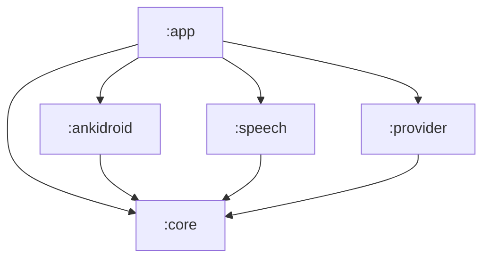

# AnkiVoice for Android

- Issue: [#48 — AV-041: Bootstrap the Android build and port the AV-007 contract types](https://github.com/BrockBadeaux14/AnkiVoice/issues/48).
- Decision: [AV-022: Android implementation](../docs/decisions/0022-android-implementation.md)
  (native Kotlin, one Gradle build, five modules).
- Specification: [AV-007: Integration contracts and review lifecycle](../docs/contracts/av007-session-contracts.md).

This is the Gradle build and the Kotlin copy of the AV-007 contracts that every Android
card builds on. AV-023 (#24) adds the Compose shell, AnkiDroid access preflight and deck
selection, permission onboarding, app-private settings, and a debug sample-session
preview. See the [AV-023 results](../docs/testing/av023/results.md) and
[runbook](../docs/testing/av023/runbook.md). AV-039 (#10) adds VoiceQA note type
provisioning behind an explicit setup action: see the
[AV-039 results](../docs/testing/av039/results.md) and
[runbook](../docs/testing/av039/runbook.md). Real card access, speech, network access and
ReviewSession integration belong to #25, #26, #17 and #14.

## Build

Requirements:

- A JDK 17 or newer to run Gradle. The build emits Java 17 bytecode whatever JDK runs it.
- The Android SDK with `platforms;android-36` and `build-tools;36.0.0`. Point
  `ANDROID_HOME` at it, or put `sdk.dir=…` in `android/local.properties`, which is
  gitignored.

```sh
cd android
./gradlew checkModuleBoundaries :core:test assembleDebug
./gradlew :ankidroid:testDebugUnitTest :app:testDebugUnitTest :app:assembleRelease :app:lintDebug
```

On Windows, run `gradlew.bat` with the same arguments.

| Task | What it checks |
| --- | --- |
| `checkModuleBoundaries` | The module graph follows AV-022 (see [Modules](#modules)). It also runs as part of `check`. |
| `:core:test` | The contract-level JVM tests and the Kotlin half of the drift guard. |
| `assembleDebug` | All five modules compile, and `:app` produces `app/build/outputs/apk/debug/app-debug.apk`. |
| `:ankidroid:testDebugUnitTest :app:testDebugUnitTest` | AV-023's access classification, deck selection, session cancellation and lifecycle regression tests, and AV-039's provisioning outcomes and note type loader. |
| `:app:assembleRelease :app:lintDebug` | Release compilation without fakes; Android lint. |

[`.github/workflows/android.yml`](../.github/workflows/android.yml) runs both commands on
`ubuntu-24.04` with Temurin 17, for every push and pull request. The
[`VoiceQA fixtures`](../.github/workflows/fixtures.yml) workflow runs the Python half of
the drift guard.

## Pins

Every version is pinned in [`gradle/libs.versions.toml`](gradle/libs.versions.toml),
except the Gradle wrapper, which is pinned in
[`gradle/wrapper/gradle-wrapper.properties`](gradle/wrapper/gradle-wrapper.properties).

<!-- av041:pins:begin -->

| Pin | Value | Source |
| --- | --- | --- |
| Gradle wrapper | `9.3.1`, `all` distribution, SHA-256 `17f277867f6914d61b1aa02efab1ba7bb439ad652ca485cd8ca6842fccec6e43` | AV-022 baseline |
| Android Gradle plugin | `9.1.0` | AV-022 baseline |
| Compile SDK | `36` | AV-022 baseline |
| Target SDK | `35` | AV-022 baseline |
| Minimum SDK | `33` | AV-022 baseline (install floor, not a support claim) |
| Build tools | `36.0.0` | AV-022 baseline |
| Bytecode | Java `17` | AV-022 baseline |
| Kotlin | `2.4.20`: the Kotlin JVM plugin, the Compose compiler plugin and `kotlin-reflect` (tests only) | AV-041 |
| Compose BOM | `2026.06.01`, which resolves Compose `1.11.4` and supplies `material3` | AV-041 |
| AndroidX Activity | `androidx.activity:activity-compose` `1.13.0` | AV-041 |
| JUnit | `6.1.3`, through `org.junit:junit-bom` (Jupiter and the platform launcher) | AV-041, tests only |

<!-- av041:pins:end -->

Why these AV-041 pins:

- **Kotlin 2.4.20** was the newest stable Kotlin when this was pinned. AGP 9's built-in
  Kotlin support compiles the Android modules with the Kotlin Gradle plugin on the root
  classpath, so this one version covers `:core`, the Android modules and the Compose
  compiler.
- **Compose BOM 2026.06.01** is the newest BOM that compiles against SDK 36. BOMs from
  `2026.08.00` onward resolve Compose 1.12, whose AAR metadata requires compile SDK 37.
  AGP 9.1.0 recommends 36 as its maximum, and moving compile SDK is outside AV-022's
  baseline. `checkDebugAarMetadata` fails with the newer BOM.
- **Activity 1.13.0** was the newest stable `activity-compose`, and it compiles against
  SDK 36.

Build JDK: the validation below ran Gradle on Android Studio's JBR 25.0.2, the JDK in
AV-022's baseline. CI runs it on Temurin 17.

## Modules



| Module | Kind | Contents now | Owner of what comes next |
| --- | --- | --- | --- |
| `:core` | Kotlin/JVM, no Android plugin or dependency | The AV-007 contract port in `org.ankivoice.core.contracts`; AV-013's session state machine in `org.ankivoice.core.session`; the fakes in its `testFixtures` source set | #16/#18, #15, #20 |
| `:ankidroid` | Android library | Access preflight; `decks` reads and verified `selected_deck` updates; AV-039 VoiceQA provisioning with read-back | #25 |
| `:speech` | Android library | AV-025's speech transport: the pinned TTS/recognizer route, the app-owned microphone pipe, and the ordering, cancellation and failure rules behind both AV-007 speech contracts | #13 |
| `:provider` | Android library | A marker object; no platform calls or network access | #17, #18 |
| `:app` | Android application | Single-activity shell, onboarding, the VoiceQA setup action and its full-sync disclosure, private settings, lifecycle delivery and debug sample session | #27, #17 |
| `:core` | Kotlin/JVM, no Android plugin or dependency | The AV-007 contract port in `org.ankivoice.core.contracts`; AV-012's answer policy in `org.ankivoice.core.answer`; AV-015's rule-based grading in `org.ankivoice.core.grading`; AV-013's session state machine in `org.ankivoice.core.session`; the fakes in its `testFixtures` source set | #18, #15, #20 |
| `:ankidroid` | Android library | Access preflight; `decks` reads and verified `selected_deck` updates | #25, #10 |
| `:speech` | Android library | AV-025's speech transport: the pinned TTS/recognizer route, the app-owned microphone pipe, and the ordering, cancellation and failure rules behind both AV-007 speech contracts | #13 |
| `:provider` | Android library | AV-020's credential store, free-route guard, durable quota ledger, content-free diagnostics and the one HTTPS seam | #18 |
| `:app` | Android application | Single-activity shell, onboarding, private settings, lifecycle delivery and debug sample session | #27, #17 |

`checkModuleBoundaries` fails the build when:

- a module depends on a project AV-022 does not allow;
- a module other than `:provider` declares `android.permission.INTERNET`, `:provider`
  stops declaring it, or any module declares `android.permission.READ_PHONE_STATE`;
- `:app` stops depending on all four other modules;
- `:core` applies an Android plugin or declares an `android*`, `androidx*` or
  `com.google.android*` dependency;
- a feature variant of `:core`, such as its test fixtures, is added to a configuration
  that a release build can see.

### The fakes

The in-memory fakes live in `core/src/testFixtures`, so they reach JVM tests and debug
builds only:

```kotlin
testImplementation(testFixtures(project(":core")))  // in :core this is automatic
debugImplementation(testFixtures(project(":core")))  // what :app declares
```

`:app` proves both sides. Its `src/debug` composition root reads the demo collection from
the fakes. Its `src/release` counterpart supplies no card provider: study is unavailable
while onboarding and deck selection remain usable. The release APK contains no
`org.ankivoice.core.fakes` classes.

## The contract port

`:core` ports the part of [`tools/av007_contracts.py`](../tools/av007_contracts.py)
before `GuardedReviewWriter`, and all of [`tools/av007_fakes.py`](../tools/av007_fakes.py)
except `FakeReviewWriter`. The Python binding is unchanged and stays the executable
reference.

| Python | Kotlin (`org.ankivoice.core.contracts`) |
| --- | --- |
| `CardIdentity`, `CardState`, `VoiceQAFields`, `ScheduledCard`, `QueueExhausted`, `VOICEQA_MODEL` | Same names. `QueueExhausted` is a `data object`. |
| `Capabilities` | `Capabilities`, with the same defaults. A negative cap throws `IllegalArgumentException`. |
| Five `*Failure` enums, `ALL_FAILURE_MODES`, `Failure` | Five enums under `sealed interface FailureMode`, plus `Contract`, `failureModes(contract)`, `ALL_FAILURE_MODES` and `Failure`. |
| `ScheduledCard \| QueueExhausted \| Failure` and the other unions | The sealed results `CapabilitiesResult`, `NextCardResult` (which includes `ReadCardResult`) and `GradingOutcome`. |
| `Utterance`, `UtterancePurpose`, `GradingContext` and their builders | Same names: `questionUtterance`, `revealUtterance`, `elaborationUtterance`, `gradingContext`, `cardLanguage`. |
| `GradeLabel`, `AUTOMATIC_PROPOSALS`, `GradingResult.proposed_rating` | `GradeLabel.automaticProposal`, an exhaustive `when`, and `GradingResult.proposedRating`. |
| `OperationToken`, `TranscriptKind`, `Confidence`, `CaptureEvent`, `PlaybackResult`, `GradingRequest`, `GradingReply`, `ConfirmationSource`, `RatingConfirmation` | Same names. `CaptureEvent` and `PlaybackResult` are sealed. |
| `ReviewState`, `TERMINAL_REVIEW_STATES`, `ReviewIntent`, `RawAcknowledgement`, `ReviewOutcome` | Same names. `ReviewState.isTerminal`; `RawAcknowledgement` is sealed. |
| `CardProvider`, `SpeechOutput`, `SpeechInput`, `Grader`, `ReviewTransport`, `ReviewWriter` | Interfaces with the same operations. |
| `MonotonicClock` | `fun interface MonotonicClock`, plus `SystemMonotonicClock` backed by `System.nanoTime`. |
| `tools/av007_fakes.py` | `org.ankivoice.core.fakes`: `FakeClock`, `FakeCollection`, `StoredCard`, `RecordedReview`, `FakeCardProvider`, `WriteAnomaly`, `FakeReviewTransport`, `FakeSpeechOutput`, `FakeSpeechInput`, `FakeGrader`, `demoCard` and `demoCollection`. |

Left for later cards: `is_one_review_transition`, `GuardedReviewWriter` and
`FakeReviewWriter` go to #25. `ReviewSession`, `SessionState`, `Halt`, `Event`,
`Interruption`, `transcript()` and the 53 scenarios go to #14.

### Representation choices

These keep the specification's meaning while using Kotlin types:

- **Every operation result is exhaustively matchable.** Where Python returns a union, or a
  value with an optional failure, Kotlin returns a sealed type:
  - `PlaybackResult` is `Completed` or `Failed`.
  - `CaptureEvent` is `Transcript` or `Failed`.
  - `RawAcknowledgement` is `UpdateCount`, `NullResponse` or `ErrorResponse`.

  The specification says a failure takes precedence over any accompanying text. The
  Python binding can express a capture with both text and a failure; in Kotlin a failed
  capture has no text field at all.
- **Specification spelling.** Enum constants keep the Python member names (`ACCESS_DENIED`),
  and each enum's `specName` is the specification's spelling (`accessDenied`,
  `outcome-unknown`, `learner-corrected`). `Failure.toString()` prints
  `CardProvider.accessDenied: detail` where Python prints `CardProvider.access_denied: detail`.
- **No failure becomes a rating.** `Failure` carries a mode, a detail and a cause, and
  nothing else. `FailureTaxonomyTest` scans every compiled `:core` class. It fails if a
  public method takes a failure, or a result that can hold one, and returns an `Int`.
- **Caller ordering errors** throw `IllegalStateException` where Python raises
  `ValueError`, for example `ReviewIntent.correct` after commit.
- **Units.** IDs, `due`, Unix-second times and milliseconds are `Long`. Ratings, counts,
  ordinals and revisions are `Int`. Tuples become `List`.
- **`ReviewIntent` stays mutable**, as in the binding, because #14 and #25 advance it in
  place. Its `state`, `elapsedMs`, `token`, `confirmation` and `interrupted` setters are
  `internal` to `:core`.
- **Operations are synchronous**, like the binding. AV-022 places each contract but fixes
  no Kotlin method signatures. Delivery across threads, whether by coroutines or
  callbacks, belongs to the cards that implement the transports and the session: #14,
  #25 and #26.
- **The fakes are `open`** so a test can override one call, where the Python tests
  replace a bound method. Script entries are typed (`FakeSpeechInput.Say`, `Fail` and
  `Deliver`, and the equivalents for the other fakes). A `null` provider script entry
  falls through to normal behaviour, like Python's `None`. Stand-in scheduling rounds
  ties to even, as Python's `round()` does, so both fakes produce the same card states.

### Specification and binding discrepancies

Two field names found during the port differ between the specification and the
binding. Both were resolved in favour of the specification. The binding and its tests
are unchanged.

| Where | Specification | Python binding | Kotlin |
| --- | --- | --- | --- |
| `ReviewWriter.commit` input | `ReviewIntent(cardSnapshot, …)` | `ReviewIntent.card` | `ReviewIntent.cardSnapshot` |
| `Grader.grade` input | `GradingRequest(operationToken, …)` | `GradingRequest.token` | `GradingRequest.operationToken` |

One non-semantic difference: the specification's CardProvider failure table lists
`nullCursor` fourth, while the binding declares it last. The Kotlin enum follows the
binding's order, so the drift guard can compare lists in order.

## VoiceQA provisioning

`:ankidroid` owns AV-039 (#10). `AnkiDroidProvisioning` installs the VoiceQA note type
when it is missing, reuses it when its ordered field names match the fixture, and stops
with a named conflict when they do not. `:app` supplies the explicit setup action and the
full-sync disclosure; nothing provisions on its own.

| Type | What it is |
| --- | --- |
| `VoiceQaNoteType` | The installable specification: name, ordered fields, CSS, one template, the demo deck and its four sample notes |
| `ProvisioningPlatform` | The resolver seam, extending AV-023's `AccessPlatform` with `models`, `models/<id>/templates`, `decks`, `notes`, `notes/<id>/cards` and the card move |
| `ProvisioningStatus` | `Complete`, `Declined`, `Incomplete(reasons)`, `Conflict(differences)` or `Failed(failure)` |
| `ProvisioningReport` | The status plus how far the run got: a `ProvisioningStep` per item and the number of sample notes added |
| `Provisioner` | `inspect`, which never writes, and `provision(fullSyncAccepted)`, which writes nothing without it |

`AnkiDroidProvisioning` and `AnkiDroidAccess` share one serial worker in `:app`'s
composition root, so a deck read and a collection write never overlap. Provisioning's
only writes are a `models` insert with its template update, a `decks` insert, `notes`
inserts, and a move of the cards that run just created. It reports failures with AV-007's
names: `packageUnavailable`, `apiDisabled`, `accessDenied` and `nullCursor`.

After writing a note type it is read back through `models` and its templates and compared
with the fixture; a mismatch is reported as incomplete, naming what differs. The
[AV-039 results](../docs/testing/av039/results.md) record the confirmed provider route and
the pinned-emulator evidence.
## Answer boundaries and transcript policy

- Issue: [#13 — AV-012: Integrate transcription and answer boundaries](https://github.com/BrockBadeaux14/AnkiVoice/issues/13).
- Evidence: [AV-042 result and implementation handoff](../docs/testing/av042/results.md#implementation-handoff),
  [AV-006 native speech](../docs/decisions/0006-speech-and-grading-providers.md).

`AnswerTurn` in `org.ankivoice.core.answer` is one card's answer policy above #7's
`SpeechInput` contract. It owns *when* capture may run and *what* the transcript
currently is. #26 owns the recognizer, the capture stream, platform callbacks and
cleanup; #14 owns session orchestration; #15/#27 own voice commands. Nothing here plays
audio, reads a card or writes a review, and there is no second speech implementation and
no cloud STT candidate.

The limits are AV-042's selected MVP values. They are engineering bounds, not optimized
or validated recall durations — no measurement says 15 seconds is long enough to recall
an answer.

| Limit | Value | Rule |
| --- | --- | --- |
| Thinking time | unbounded | Outside active capture. After Prompt playback settles the turn waits for an explicit Start answer, and no budget is consumed meanwhile. |
| Answer window | 15,000 ms | The default **and** the maximum active capture, from Start answer on a monotonic clock. |
| Finalization | 5,000 ms | A separate deadline from Done or window expiry, inclusive of #26's 500 ms of trailing silence. Its expiry is a timeout, not an answer. |
| Attempt lifetime | 20,000 ms | The two in sequence. The three clocks — window, attempt, finalization — stay distinct and are queried separately. |
| Automatic re-arms | 0 | No re-arm, no retry loop and no extra recognizer attempt inside one window. An explicit Try again opens a fresh bounded window with a new attempt and revision. |

### The six answer states

`partial`, `final`, `user-corrected`, `cancelled`, `timed-out` and `failed` are separate
and none stands in for another. `Answer.gradable` is true only for a `user-corrected`
transcript or a `final` the adapter classified as sufficiently confident, so **partial
text never starts grading**. Everything else returns the card with `recovery` listing the
explicit learner actions — Try again, typed correction, self-grade — all reachable by
touch.

Confidence is a policy classification #26 supplies, not an invented numeric threshold.
Absent confidence is **unknown: not zero and not certainty**. The text is kept and shown
(`needsLearnerReview`), and it is the learner accepting or editing it who makes it
gradable. `ERROR_NO_MATCH` stays `noMatch`, an undiagnosed no-result; it never becomes
`noSpeechDetected`, a network fault or a wrong answer. An empty final is the same. No
failure, cancellation, expiry or timeout ever becomes Again or an inferred wrong answer.

Window expiry stops the microphone and starts finalization; on its own it produces **no
answer**, so a window that runs out mid-speech preserves the card rather than finalizing
the learner's recall. A Done that arrives after the window already ran out is recorded as
the expiry it actually was.

### Revisions and stale results

Every settled answer, every typed correction and every Try again raises
`transcriptRevision`. A callback for another attempt, for a settled turn, or from before
Start answer is discarded into `ignored`, so a delayed transcript can never replace the
current answer. Deadlines are applied before the payload, so a final that arrives after
the finalization deadline is a timeout rather than an answer.

`bind(reply, source, permittedRatings)` is #18's `bindSuggestion` against the current
revision, so an edit or a retry invalidates the previous grading suggestion and a grade
for a superseded revision becomes `TurnGrading.Superseded` — discarded, not displayed.
The same revision is compared by `ReviewIntent.hasConfirmation`, so an edit invalidates a
pending confirmation too. **A final transcript alone never submits a review.**
`retries`, `corrections` and `recognitions` are counted separately, so #29's run can
report manual interventions apart from raw recognition success.

`AnswerBoundariesTest` drives the whole policy through the `:core` fakes with a
`FakeClock`: early recognizer closure, a two-minute think before Start answer, window
expiry mid-answer, finalization timeout, late and duplicate callbacks, Done, Cancel, Try
again, edit-after-suggestion, and every bounded `SpeechInput` failure. The AV-006
recognition failures are replayed as fixtures — the missed "Five." and "Six.", the
`it puts you first then five then seven` substitution and the preserved negations — so a
transcript-handling regression is visible without live audio.
`tests/test_av012_answers.py` fails if those fixtures stop matching the recorded AV-006
evidence, if the limits drift from the accepted handoff, or if any text-rewriting call
appears in the policy.

## Rule-based grading

- Issue: [#16 — AV-015: Implement rule-based grading and rating policy](https://github.com/BrockBadeaux14/AnkiVoice/issues/16).

`RuleGrader.grade(context)` in `org.ankivoice.core.grading` is a pure, deterministic
policy over the `GradingContext`. It returns `GradingResult(correct, reason)`, which the
existing mapping turns into a proposed Good, or `null`. A null means there is no
rule-based label and no proposed rating. The caller then asks the AI grader (#18) if one
is available, and otherwise the learner for an explicit self-grade. When the rules match,
no AI grading request is sent for that transcript revision.

The rules never conclude `incorrect`, `partial` or `uncertain`, and never propose Again,
Hard or Easy. Every result is a suggestion that needs the learner's confirmation, which
#14 and #25 enforce. The rules do not read the prompt or RequiredConcepts; concept
coverage belongs to #18.

| Step | Rule |
| --- | --- |
| Normalization | Applied to the transcript, ReferenceAnswer and each AcceptedAnswers line: NFKC, full case folding, punctuation removed, whitespace collapsed and trimmed. There is no stemming, synonym table, stop-word removal or reordering. |
| Exact match | The normalized transcript equals the ReferenceAnswer or a nonblank AcceptedAnswers line. The reason names the reference answer or accepted answer *n*, numbered by its line. |
| Fuzzy match | Tried only without an exact match. The word lists are the same length and differ in one word. That word has at least five letters on both sides, is alphabetic, and is one slip apart: one inserted, deleted or substituted letter, or two adjacent letters swapped. The reason names both words. |
| Protected words | A fuzzy match never touches digits (a fuzzy word must be alphabetic) or a word in `NUMBER_WORDS`, `NEGATIONS` or `UNITS`. Any word ending in `n't` counts as a negation. |
| Anything else | `null`, including an empty or punctuation-only transcript. |

Exact matches win over fuzzy ones. Within each step, the reference answer is tried first,
then the accepted answers in order.

Some punctuation choices are more conservative than plain removal, and the tests cover
each one:

- **Apostrophes.** An apostrophe between two word characters is kept and written as `'`,
  so "isn’t" and "isn't" agree. Any other apostrophe is removed.
- **Numbers.** Punctuation between two digits is kept, so "3.5" never matches "35" or
  "3 5".
- **Unit signs.** `%`, `‰`, `‱` and the prime signs are units, although Unicode classes
  them as punctuation. They are kept, so "50" never matches "50%".
- **Separators.** Every other punctuation mark becomes a space, so "green,blue" and
  "green blue" agree.

Known limitation: one slip can join two different words, such as "round" and "sound".
That is accepted because the result is a labelled suggestion that always needs
confirmation.

`RuleGraderTest` covers normalization, the exact and fuzzy positives, and the near-miss
negatives, including a one-letter slip on every protected word of five or more letters.
`VoiceQAFixtureGradingTest` runs every expected case in
[`fixtures/voiceqa/note-type.json`](../fixtures/voiceqa/note-type.json), read from that
file. The `:core` test task passes the file's path and declares it as an input, so a
fixture edit reruns the test. Two of the nine cases match: "Green, blue, red." and
"Five.". The other seven get no label, and no case marked `incorrect` or `partial` is
ever labelled.

## Provider credentials, usage controls and diagnostics

- Issue: [#17 — AV-020: Add provider credentials, usage controls and useful diagnostics](https://github.com/BrockBadeaux14/AnkiVoice/issues/17).
- Decision: [AV-006: Speech and grading providers](../docs/decisions/0006-speech-and-grading-providers.md).
- Evidence: [AV-020 runbook](../docs/testing/av020/runbook.md) and
  [`tools/av020-qa/validate.py`](../tools/av020-qa/validate.py).

`:provider` implements the free-only grading route. It is the app's **only** network
route: it alone declares `android.permission.INTERNET`, and `checkModuleBoundaries` fails
the build if that moves. No phone-state permission exists anywhere. Nothing here decides
a grade: #18 owns the grading instruction, the reply's content and the label policy, and
`:provider` carries the request and the reply text.

| Part | What it does |
| --- | --- |
| `KeystoreCredentialStore` | The key is entered at runtime, wrapped by a non-exportable Android Keystore AES/GCM key, and held in app-private storage. It is in no `BuildConfig` field, resource, asset or log, and the UI only ever reports *that* a key is saved. It can be replaced or cleared. |
| `FreeRoute` | AV-006's ported guard. `liquid/lfm-2.5-2.6b:free` through `liquid/fp8`, `allow_fallbacks=false`, zero maximum prompt/completion/request prices, temperature 0, JSON object output, a 1,024-token cap, and no tools, plugins, search or router. Before each session it checks the pinned endpoint for zero prices; changed, nonzero or unknown prices refuse the route. A reply served by another model or provider, or without a verified zero cost, is refused too. |
| `HttpsUrlTransport` | HTTPS only, and a 3xx is a refusal: the pinned endpoint cannot be moved by a reply. The key travels in the Authorization header and nowhere else. |
| `QuotaLedger` | Durable, append-only, flushed to the filesystem **before** dispatch, so a timeout or process death still consumes the allowance. At most 30 requests per session and a configurable daily limit, default 50 per UTC day, settable only between 0 and 1,000. A 402, a 429, an unverified cost or a refused route stops grading for the rest of the UTC day. Nothing retries automatically. |
| `Diagnostics` | Timings, failure names, request and reservation counts, and the reported cost. Every detail passes through `CredentialPolicy.redact`. Keeping transcripts and card text for #29's report is an explicit opt-in, off by default and clearable. No `:provider` API accepts audio bytes, which a test enforces. |
| `GradingProvider` | Ties them together. A missing key, an unacknowledged disclosure, a guard refusal, an exhausted allowance, a 401/403, a 402/429, a timeout or a provider error each becomes a #7 `Grader` failure (`quotaExhausted`, `providerError`, `graderTimeout`, `outputTruncated`, `unparsableResponse`) or unavailable grading. None is ever a rating; self-grading always remains. |

`:app` adds the screens to AV-023's shell and its private settings store: credential
entry, the retention disclosure, the allowance with its configurable daily limit, and the
diagnostics card. The disclosure lists what is sent (the answer text, Prompt,
ReferenceAnswer, RequiredConcepts, AcceptedAnswers), what is never sent (audio, Extra,
card or note IDs, collection data) and the limits AV-006 recorded, and grading stays off
until it is acknowledged. Replacing the key re-arms it. The wrapped key and the ledger are
excluded from backup and device transfer by
[`data_extraction_rules.xml`](app/src/main/res/xml/data_extraction_rules.xml), on top of
`allowBackup="false"`.

The tests make no live provider call, in CI or locally: `:provider` drives the whole path
through a fake transport. What a JVM test cannot show — one real request over the live
route — is the runbook's recorded smoke run on the pinned macOS ARM64 AVD, which uses the
owner's own key and is counted in the ledger. That run is **not yet recorded**.

AV-023's evidence check in [`tools/av023-qa/validate.py`](../tools/av023-qa/validate.py)
asserted that no APK carried `INTERNET`. It now says explicitly that it is checking
AV-023's retained evidence build, which predates this card; the rule that replaces it for
current builds is the module-boundary check above. `READ_PHONE_STATE` stays forbidden in
both.

## Semantic grading and optional rubrics

- Issue: [#18 — AV-016: Add structured semantic grading and optional rubrics](https://github.com/BrockBadeaux14/AnkiVoice/issues/18).
- Decision: [AV-006: Speech and grading providers](../docs/decisions/0006-speech-and-grading-providers.md).

`SemanticGrader` in `:provider` is the policy layer between #16's rules and #17's
transport. It implements the AV-007 `Grader` contract: `grade(request)` returns a
`GradingReply` bound to the request that produced it, and `cancel(request)` withdraws one.
`suggest(request, permittedRatings)` is the same work mapped to what one turn may offer.

**Rules first.** `RuleGrader.grade` runs on the current transcript revision. A rule match
sends no request and reserves no quota, and rule and AI labels are never merged: an AI
label only ever applies to a transcript the rules could not match.

| Step | Policy |
| --- | --- |
| Request | Built from the closed `GradingContext` alone: Prompt, ReferenceAnswer, RequiredConcepts, AcceptedAnswers, language, then `learner_answer` last. Extra, card and note identifiers, deck names and the key are structurally absent rather than filtered out. |
| Instruction | AV-006's pass-2 text verbatim, then one rubric sentence: with RequiredConcepts every listed concept must be present; without them the answer is graded against ReferenceAnswer and AcceptedAnswers. No deck edit and no new note field is needed. |
| Decoding | #17's pinned route unchanged: `liquid/lfm-2.5-2.6b:free` through `liquid/fp8`, temperature 0, JSON object output, a 1,024-token cap. |
| Reply | Accepted only as exactly `{"label", "reason"}` with one of the four labels and a nonblank reason. Empty, malformed, truncated, non-terminating, extra-field, unknown-field and trailing-content replies are rejected. A rejected reply is not a grade: it never becomes `incorrect` or `uncertain`. |
| Deadline | 20 seconds per attempt, against AV-006's 12.253-second observed maximum. |
| Retry | Exactly one, automatic, only on a timeout or an invalid reply. |
| Mapping | The existing `GradeLabel.automaticProposal`: `correct` proposes Good, `incorrect` proposes Again, `partial` and `uncertain` propose nothing. A proposal outside the card's `permittedRatings` is dropped, never substituted. |
| Failure | Any `GradingUnavailable` cause or `Grader` failure keeps the card and falls back to an explicit self-grade. Nothing writes a review, and no failure switches to a paid or alternative provider. |

**Card text and transcripts are content, never instructions.** They travel as JSON string
values, so nothing in them can close the envelope or add a field, and the reply schema is
closed, so nothing in them can become a label either. `SemanticGraderTest` covers card
text and a transcript that both try to force `correct`.

### The retry and what it costs

The retry is a change to #17's stated policy that retries are the caller's explicit
choice. Its consequences were accepted on the card before it was implemented:

- It **reserves from the ledger like any other request**. It is not exempt from the
  30-request session cap or the daily limit, and a retry the allowance refuses is not
  attempted — the turn falls back to self-grading.
- Worst-case learner-visible latency for one graded turn is about **40 seconds**, and a
  fully AI-graded session can exhaust the session cap in **15 turns**. #29's 30-turn run
  must expect self-grading to carry part of the run; that is accepted, not a defect.
- It never fires on a well-formed grade, a 401/403, a route refusal or a quota stop, all
  of which are terminal for the turn or the session. `GradingProvider.unavailableCause`
  holds that state, and the grader reads it rather than guessing from a message.
- It re-sends the **same transcript revision**. If the transcript changed while the first
  attempt was in flight the attempt is abandoned, not retried.

### Suggestions are bound to a revision

`GradingSuggestion` in `:core` carries the `GradingRequest` that produced it, so a label
always names the transcript revision it graded. Editing or retrying the transcript raises
the revision, `appliesTo` turns false, and a reply for the older revision binds to
`TurnGrading.Superseded`: discarded rather than displayed. The same revision is compared
by `ReviewIntent.hasConfirmation`, so an edit invalidates a pending confirmation too.
Every proposal still needs explicit learner confirmation (#21); nothing here submits a
review, and turn orchestration (#14) and evaluation (#19) stay where they are.

`SemanticGraderTest` drives the whole path through a fake transport: rule-matched
transcripts, each of the four labels, the eleven rejected reply shapes, adversarial card
text and transcripts, timeout-then-successful-retry, timeout-then-timeout, a retry the
allowance refuses, terminal 401/402/429 and route refusals, a transcript edited
mid-flight, a stale reply after a new revision, and a withdrawn request. No live call is
made, in CI or locally. What a JVM test cannot show is the live route, which is #17's
recorded smoke run; #29 owns integrated acceptance.

## Drift guard

[`tools/av041_manifest.py`](../tools/av041_manifest.py) derives
[`core/src/test/resources/av007/manifest.txt`](core/src/test/resources/av007/manifest.txt)
from the Python binding. The manifest covers:

- contract names and operations, and the `ReviewTransport` seam;
- the failures under each contract;
- the capability flags and their defaults;
- the review states and which are terminal;
- the grade labels and their proposals.

Each check fails in its own place:

- `tests/test_av041_android.py` fails if the checked-in manifest is stale, or if a
  name is not spelled as the specification spells it.
- `ManifestDriftTest` in `:core` fails if the Kotlin port differs from the manifest.

After an intentional change to `tools/av007_contracts.py`:

```sh
python tools/av041_manifest.py --write
python -m unittest tests.test_av041_android -v
cd android && ./gradlew :core:test
```

AV-039 uses the same shape for the note type itself.
[`tools/av039_note_type.py`](../tools/av039_note_type.py) derives
[`ankidroid/src/main/resources/av039/voiceqa-note-type.properties`](ankidroid/src/main/resources/av039/voiceqa-note-type.properties)
from [`fixtures/voiceqa/note-type.json`](../fixtures/voiceqa/note-type.json). The app
cannot read that JSON directly: `org.json` is stubbed in JVM unit tests and AV-022's pins
add no JSON library, so the derived resource is read with `java.util.Properties`, which
both the host JVM and Android supply. `tests/test_av039_note_type.py` fails if the
checked-in copy is stale or escapes a value a properties parser would not return
unchanged; `VoiceQaNoteTypeTest` fails if the Kotlin loader disagrees with the resource,
or if the resource is not packaged where the app looks for it.

AV-013 guards the ported conformance suite the same way.
[`tools/av013_scenarios.py`](../tools/av013_scenarios.py) derives
[`core/src/test/resources/av007/scenarios.txt`](core/src/test/resources/av007/scenarios.txt)
from [`tools/av007_scenarios.py`](../tools/av007_scenarios.py): the 19 named scenarios by
name, the 34 failure modes by contract, and the binding's session states and interruption
kinds. `tests/test_av013_session.py` fails if the checked-in copy is stale or a named
scenario has no `@Scenario` in the Kotlin suite; `ScenarioDriftTest` in `:core` fails if
the ported suite, the failure taxonomy, the binding-state coverage or the interruption
kinds disagree with it.

After an intentional change to `tools/av007_scenarios.py`:

```sh
python tools/av013_scenarios.py --write
python -m unittest tests.test_av013_session -v
cd android && ./gradlew :core:test
```

AV-016 pins AV-006's grading instruction the same way, without a generated file:
`tests/test_av016_grading.py` parses `tools/av006_providers.py` and fails if
`GradingInstruction.PINNED` drifts from the measured pass-2 text, or if the deadline, the
single retry or the route's decoding settings move. It parses rather than imports that
script, which needs POSIX `fcntl`, so it runs on any host.

After an intentional change to `fixtures/voiceqa/note-type.json`:

```sh
python tools/av039_note_type.py --write
python -m unittest tests.test_av039_note_type -v
cd android && ./gradlew :ankidroid:testDebugUnitTest
```

## What this does not establish

- AV-041's original validation built the debug APK without launching it. AV-023 now
  records a focused onboarding/deck/session run on the pinned macOS ARM64 AVD in its
  [results](../docs/testing/av023/results.md). Physical-device behavior remains unverified.
- AV-041's original local validation ran on a Windows 11 x86_64 host, not the macOS ARM64 evidence host
  with AV-022's validated pins. A JVM build and its unit tests do not depend on the host.
  Any device or emulator evidence in later cards still needs the pinned host.
- The fakes are not a scheduler. They cannot prove timing, threading or Android lifecycle
  behaviour.
- AV-039's provider route is confirmed on the pinned emulator with AnkiDroid 2.24.1 only.
  No sync was performed, so the full-sync consequence the disclosure states is Anki's
  documented schema rule rather than something this build observed. See the
  [AV-039 limits](../docs/testing/av039/results.md#what-this-does-not-establish).

## AnkiDroid adapter and review safeguards

AV-024 (#25) adds `AnkiDroidCardProvider`, `AnkiDroidReviewTransport` and the
platform-independent `GuardedReviewWriter`. The existing `AndroidAccessPlatform`
owns every resolver call. All production calls run on the composition root's
serial worker; token-tagged read overloads deliver on the main executor.

The provider resolves the selected deck's `maxTaken`, reads per-card answer
buttons from `schedule`, resolves the full card/note/model identity, and splits
VoiceQA fields on the unit separator. Null cursors, missing decks/cards,
unsupported note types and malformed cards remain distinct. Collection changes
are detected when readable IDs no longer agree; no collection-generation token
exists, so a restore with identical IDs cannot be proven absent.

The writer requires explicit confirmation, re-reads both the offered card and its
ID, compares identity/state/content, rechecks ratings and cancellation, writes
once, and verifies the same card. Only an acknowledged consistent one-review
transition confirms. Unknown outcomes cannot replay. Outcomes carry the evidence
needed by #20; nothing here persists a journal. `FakeReviewWriter` is available
in test fixtures. Session orchestration and full UI wiring remain #14/#27.

Both debug and release shell paths now use the real provider. Start reports
Card ready or Queue exhausted for the selected deck; no review writer is exposed
by the shell. This supersedes the historical AV-041/023 fake-preview and release
unavailability descriptions above. See the [AV-024 results](../docs/testing/av024/results.md)
and [runbook](../docs/testing/av024/runbook.md) for validation and limits.

## Card eligibility and bounded skipping

AV-010 (#11) adds `core/eligibility` and the shell's rejection report. The pure
classifier validates the VoiceQA schema, required fields, card template and BCP 47
Language syntax. Each rejection identifies the card and the field or note type to
fix, with an `ANNOUNCEMENT` utterance ready for the speech layer.

The adapter reads progressively larger scheduled prefixes and excludes rejected
candidates only in memory. It preserves scheduler order and writes nothing. Five
consecutive rejections stop the preview with a reason summary; a valid card resets
the count. Exhaustion and provider failures remain distinct. All existing
utterance and grading-context builders are reused. See the
[AV-010 results and validation](../docs/testing/av010/results.md), including the
pinned API evidence and runtime limitations.

## Speech transport

AV-025 (#26) fills `:speech` with the route AV-042 proved live, behind AV-007's
`SpeechOutput` and `SpeechInput`. `SpeechModule.create` returns one `SpeechTransport`
per session; it is both contracts, so #13 holds a single object.

`AndroidSpeechPlatform` is the only class that touches `TextToSpeech`,
`SpeechRecognizer` and `AudioRecord`. Everything that decides an outcome lives in
`SpeechTransport` and is verified on the JVM against `FakeSpeechPlatform`, so the
ordering, deadline and stale-callback rules need no emulator.

### The pinned route

`SpeechPins` holds the values accepted with PR #57. Changing one invalidates the live
evidence behind it, so change this file and the [AV-042 handoff](../docs/testing/av042/results.md#implementation-handoff)
together.

| Element | Pinned value |
| --- | --- |
| Engine | `com.google.android.tts`, local voice `en-US-language`, configurable rate |
| Recognition | `GoogleTTSRecognitionService`, `en-US`, `EXTRA_PREFER_OFFLINE=false` |
| Capture | App-owned `MIC` `AudioRecord`, mono PCM16 at 16 kHz, streamed through `EXTRA_AUDIO_SOURCE` |
| Segment end | Closing the pipe's write end |
| Settle | At least 400 ms after playback, before capture may open |
| Done | Stop the microphone, emit 500 ms of trailing silence, close the pipe |
| Finalization | A final or failure within 5,000 ms of Done, inclusive of that silence |
| Permission | `RECORD_AUDIO` only |

`EXTRA_PREFER_OFFLINE` is `false` deliberately: AV-042's first probe set it to `true`
and produced no-match on every attempt.

### Ordering and ownership

Playback completes, the settle interval opens, and capture opens **only** when #13 calls
`listen` — that call *is* the explicit Start answer. Capture never opens during playback,
at most one capture is active, and the transport never re-arms after a result. Thinking
time, the answer window, the transcript and every retry decision stay with #13.

`finishAnswer` is Done. It stops the microphone, lets the pump append the trailing
silence and close the pipe, then starts the finalization deadline. It is not a verdict
about the answer. `answerWindowMs` exists only as a backstop for a stop that never
arrives; reaching it behaves exactly like Done, so an in-flight final is still delivered.

The transport receives an `Utterance` and never a `ScheduledCard`, so Extra has no path
into question audio through this module and the Prompt-only rule stays in
`core/contracts/Utterances.kt`.

### Failures

Every platform condition maps onto AV-007's `SpeechOutput`/`SpeechInput` taxonomy, which
is not extended here. Where several conditions share one mode, the `Failure` detail
carries the distinction — `SpeechTransport`'s constants are the spellings.

`ERROR_NO_MATCH` stays an undiagnosed no-result; an empty final is reported separately by
detail. Losing the capture device or route, and the platform silencing the capture client,
are reported as `EARLY_CLOSURE` with their own detail, so the silence that follows a
hardware fault is never read as the learner staying quiet. Absent recognizer confidence is
`ABSENT`, never zero and never certainty. No
failure writes a review, infers a rating or substitutes another provider — there is no
second speech implementation and no cloud STT candidate in this module.

Cancel and `releaseAll` invalidate the generation before cleanup runs, so callbacks
already in flight are recorded as stale and dropped. Each capture delivers exactly one
event.

### The capability preflight

`SpeechReadiness` resolves the engine, voice and recognition service for a language and
returns the first thing that would stop a turn, or null. `:app` joins it to #23's access
preflight through `SpeechAwareAccess`, on a worker thread, so the shell cannot report a
learner ready to study and then fail in the middle of a card. An AnkiDroid failure still
wins, and a capability check that throws is a failure rather than a ready device.

### What this does not establish

The offline suite proves the transport's rules, not recognition quality. Live evidence
comes only from [the AV-025 runbook](../docs/testing/av025/runbook.md) on the pinned AVD.
Backgrounding, screen lock, audio-route changes, Bluetooth and real calls are out of
scope here and remain with #32; AV-040 recorded that no interruption signal reaches the
app while the recognizer holds the microphone, and nothing in this module changes that.

## Session state machine

AV-013 (#14) ports `ReviewSession` from
[`tools/av007_contracts.py`](../tools/av007_contracts.py) into
`org.ankivoice.core.session`. It is the single owner of turn progression across AV-007's
five-state review lifecycle, and it reaches the recognizer, the synthesizer, the
collection and the grader only through AV-007's contracts, so no platform type appears in
`:core`.

### The states

The binding folds several conditions into `paused`/`stopped` and has no state for retry
or reveal. AV-013 separates them, and `SessionState.binding` records the correspondence so
the ported suite can still assert against its source:

| Kotlin state | Binding state | Meaning |
| --- | --- | --- |
| `IDLE` | `idle` | No card is open |
| `ASKING` | `asking` | Question playback in flight; capture may not open |
| `LISTENING` | `listening` | The answer phase; AV-012 owns the finer detail |
| `RETRYING` | `listening` | An explicit Try again opened a new revision |
| `GRADING` | `grading` | A gradable transcript exists for this revision |
| `REVEALING` | — | Reveal or elaboration playback; transient |
| `PROPOSING` | `proposing` | A pending review is open for correction |
| `COMMITTING` | `committing` | The single write is in flight |
| `COMMITTED` | `committed` | Confirmed; awaiting advance or a native-undo handoff |
| `PAUSED` | `paused` | Resumable; the learner may fix the cause |
| `OUTCOME_UNKNOWN` | `paused` | A write may have landed; reconcile first |
| `INTERRUPTED` | `stopped` | The single-active-reviewer precondition broke |
| `UNSUPPORTED` | `stopped` | The offered card is not a usable VoiceQA card |
| `STOPPED` | `stopped` | Reload the collection to continue |
| `EXHAUSTED` | `exhausted` | The queue emptied normally |

`OUTCOME_UNKNOWN` never retries the write and never advances. It stays until the learner
reports what AnkiDroid actually shows, and no later halt can erase that obligation.

### Tokens, ordering and confinement

Session, card, turn and attempt are bound into every token. AV-012 mints capture tokens
under a namespaced session id, so a capture token can never equal a playback, grading or
proposal token that shares a turn and sequence. A callback whose token does not match the
operation in flight is dropped and logged, never applied — which is what keeps a
superseded turn from advancing the wrong card, overlapping playback with recording, or
producing a second rating for one answer.

Teardown follows AV-022's **invalidate-then-clean-up** order: every token is cleared
*before* anything is cancelled, because cancellation itself produces late callbacks. Three
tests drive fakes that answer their own `cancel()` and assert the answer is dropped.

Every transition is confined to the thread that constructed the session — the main thread
in the app. A recognizer, synthesizer or grader callback must be posted to that thread;
calling in from another one throws rather than corrupting the turn.

### Nothing writes a review by itself

A rating reaches the writer only from `commit`, only for an intent carrying a current,
final, sufficiently confident confirmation for this attempt and revision. Silence, a
timeout, a speech failure, a grading failure and a confident model are none of them
confirmations, and a transcript edit discards the pending suggestion, the pending rating
and any confirmation bound to the old revision.

Every fault from `:speech` or AV-012 routes into a halt that preserves the card.
`recoveryOptions` names the explicit manual controls it offers; self-grade appears only
when a gradable transcript exists, because a fault never supplies one.

### The conformance suite

`core/src/test/.../session` ports the 53 scenarios of
[`tools/av007_scenarios.py`](../tools/av007_scenarios.py) as JVM tests against the fakes:
19 named scenarios and a 34-mode failure sweep, with no emulator and no network. The
[drift guard](#drift-guard) keeps them in step with the Python source.

### What this does not establish

The offline suite proves the turn's ordering and guards, not that a turn works on a
device. The live check is [the AV-013 runbook](../docs/testing/av013/runbook.md), which
has discharged AV-025's absorbed live verification and carried one spoken answer through
to a verified guarded write. One turn is not a reliability estimate, and the pinned
recognizer reported absent confidence throughout, so every spoken answer needed a manual
acceptance; [results](../docs/testing/av013/results.md) records every attempt.
