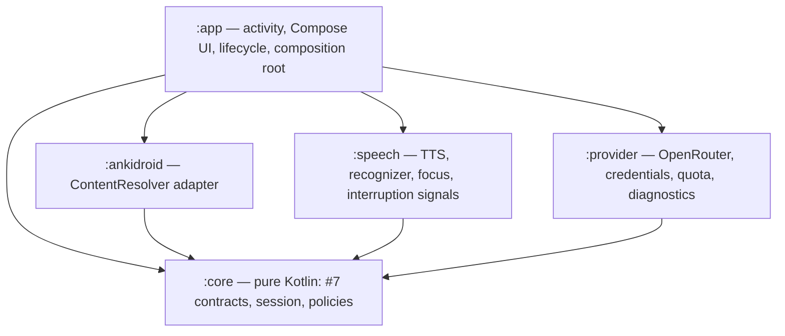
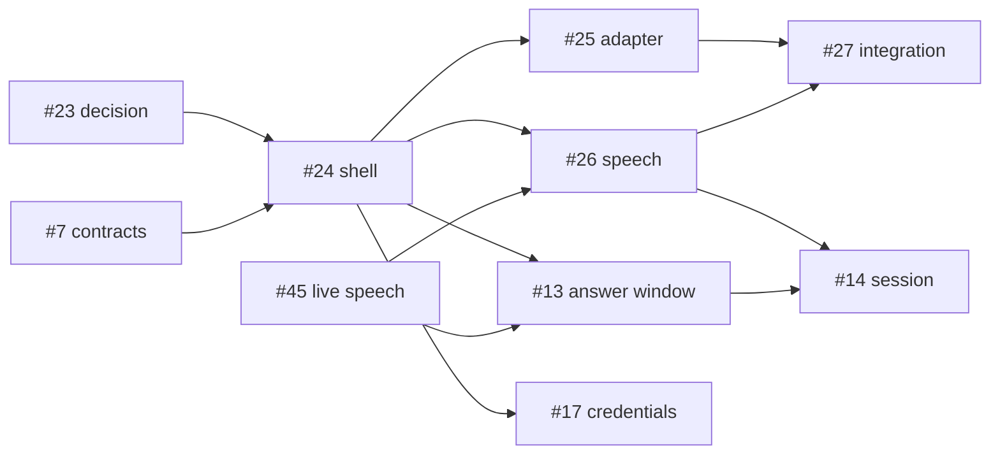

# AV-022: Android implementation

- Issue: [#23 — Choose and specify the Android implementation](https://github.com/BrockBadeaux14/AnkiVoice/issues/23).
- Date: September 14, 2026. Status: ready for review; acceptance pending.
- Dependencies: #4, #5 and #6 are closed and Done on the board. #7 is closed and is
  read here as design input; its completion gates implementation integration in
  #24/#25, not this decision. #45 is open and gates speech implementation in #13/#26,
  not this decision. #23 had no discussion comments when fetched.
- Scope: a written architecture decision. No framework code, Gradle project, emulator
  run or provider request was made for it. Issue numbers are GitHub numbers, which do
  not always match AV plan IDs.

## Decision

**Kotlin, native Android.** One Gradle project, Kotlin throughout, a single activity
with a Jetpack Compose UI, and session state confined to the main thread. No Flutter,
no platform channel and no bridge.

Kotlin scores **55/60** against **29/60** for Flutter with a Kotlin bridge. Every
transport the feasibility work proved is an Android framework API: AV-004's
`ContentResolver` route, AV-005/AV-006's `TextToSpeech` and `SpeechRecognizer`, and
the audio-focus and activity-lifecycle hooks AV-005 exercised. AV-007's rules have to
be enforced where those APIs report their results. Under Flutter, all of that code
would still be Kotlin, and on top of it would sit a channel schema, a Dart mirror of
every result type and a second owner of session state.

Key tradeoffs accepted:

- No shared code with a future iPhone app. iPhone work is deferred and has no
  established Anki integration route (#36).
- No Flutter hot reload or Dart UI, even though a Flutter SDK is installed on the host
  where this record was written. That familiarity is counted in criterion 4 below.
- AV-007's Python binding has to be ported to Kotlin. It stays in the repository as
  the executable reference and is never shipped.

## Rubric scores

Each criterion is scored 1–5:

- **5** means the framework meets the criterion directly, with evidence in this
  repository.
- **3** means it can meet the criterion only through extra mechanism that has to be
  built and verified first.
- **1** means it works against the criterion.

Criteria 1–3 carry weight 3. Criterion 4 carries weight 2. Criterion 5, deferred
platforms, carries weight 1: it is weighted last, as the issue requires, and on its own
it cannot change the outcome.

<!-- av022:scores:begin -->

| # | Criterion | Weight | Kotlin | Flutter + Kotlin bridge |
| ---: | --- | ---: | ---: | ---: |
| 1 | Native reach for the proven transports | 3 | 5 | 2 |
| 2 | Capability-flag fidelity | 3 | 5 | 3 |
| 3 | Lifecycle control | 3 | 5 | 2 |
| 4 | Cost to first working vertical slice | 2 | 4 | 2 |
| 5 | Deferred-platform value | 1 | 2 | 4 |
| | **Weighted total (maximum 60)** | | **55** | **29** |

<!-- av022:scores:end -->

**Sensitivity.** The result holds under every variation tried:

- **Unweighted:** Kotlin 21, Flutter 13.
- **Flutter at 5 on both criteria 4 and 5:** Flutter reaches 36 weighted.
- **Criterion 5 removed or its scores swapped:** Kotlin still leads.

Flutter would win only if criteria 1–3 were scored close to even, and the evidence below
does not support that.

### 1. Native reach for the proven transports

| Transport | Proven by | Android API | Kotlin | Flutter |
| --- | --- | --- | --- | --- |
| AnkiDroid reads | [#4](../testing/av004-ankidroid-review-access.md) | `ContentResolver.query` on `content://com.ichi2.anki.flashcards/` (`decks`, `selected_deck`, `schedule`, `cards`, `notes`, `models`), permission `com.ichi2.anki.permission.READ_WRITE_DATABASE`, `<queries>` for the package and authority | Direct | Kotlin plugin. The bridge marshals cursor rows into typed records: the identity tuple (card, note, deck, ordinal, model), six stored-state fields, unit-separator note fields, and the ratings and interval strings offered for each card. |
| AnkiDroid review write | #4 | One `ContentResolver.update` on `schedule`, then a re-read of the same card | Direct | The write and the verification re-read must run in the same Kotlin call. That is the only way to keep #7's "exactly one write, then verify" on one side of the channel. |
| Question and reveal audio | [#5](../testing/av005-foreground-speech.md), [#6](0006-speech-and-grading-providers.md) | `TextToSpeech` bound to `com.google.android.tts`, `UtteranceProgressListener` | Direct | Kotlin plugin plus an event channel for start, done, stop and error. |
| Answer capture | #5, #6 | `SpeechRecognizer` bound to the pinned recognition service, `RecognitionListener`, called on the main thread only | Direct | Kotlin plugin streaming partial, final, error and level events, each carrying a token. |
| Focus and lifecycle | #5 | `AudioFocusRequest`, activity callbacks | Direct | Forwarded as events; see criterion 3. |

Dart can reach none of these without platform code. Community TTS and recognition
plugins would not meet [#26](https://github.com/BrockBadeaux14/AnkiVoice/issues/26)
whatever their features, because #26 requires the app itself to own recognizer
serialization, service pinning, stale-callback rejection and platform failure
classification. Adopting one would also mean re-running AV-005's matrix against it,
which is a new experiment. No Flutter route to AnkiDroid is part of AV-004's evidence.
Under Flutter, the bridge would be the same Kotlin adapters as the Kotlin option, plus
a typed channel schema, plus Dart mirrors.

### 2. Capability-flag fidelity

[#7](../contracts/av007-session-contracts.md) defines nine capability flags and 34
enumerated failures across its five contracts. It also requires four distinctions to
survive intact:

- a null cursor versus a valid empty queue;
- a missing deck versus an exhausted queue;
- `noMatch` versus proven `noSpeechDetected`;
- an acknowledged write versus a verified one (AV-004 saw `update_count=1` with no
  saved review).

None of these failures is ever a rating.

With **Kotlin**, each result is a sealed type that the compiler checks exhaustively. The
code that classifies a result runs in the same process and type system as the
`Cursor` null check and the caught `SecurityException` it classifies. Nothing is
serialized between the observation and the decision.

With **Flutter**, classification can still happen only in Kotlin, the only place that
sees the `Cursor` or the exception, and the result then has to be re-encoded for Dart:

- A channel's default error path is a platform exception with a string code.
- A Kotlin `null` arrives in Dart as `null`, which is exactly the null-cursor/empty-queue
  ambiguity #7 forbids unless every reply is wrapped.

Generated typed messages can encode these distinctions. But the 34 failures and nine
flags would then exist twice, and drift between the two lists becomes a new way to lose
one. That is achievable with discipline, so it scores 3 rather than 1.

### 3. Lifecycle control

The hooks AV-005 exercised were:

- activity `onPause`/`onResume`;
- an `AudioFocusRequest` listener dispatched on the main `Handler`;
- `UtteranceProgressListener` callbacks posted from binder threads to the main thread;
- `RecognitionListener` callbacks on the main thread;
- `SystemClock.elapsedRealtime` for monotonic time.

AV-005 also found two gaps. The emulated call produced a 5,597 ms focus loss **without**
`onPause`, and the app's own playback-to-capture handoffs produced 31 focus losses of
916–1,964 ms. On top of that, #7 requires tokens to be invalidated *before* cleanup is
requested, and a stopped session must not be resumable by any callback.

With **Kotlin**, the activity that receives `onPause` or `onStop` can invalidate the
session token and cancel playback or capture in the same main-thread turn, with no
hop in between. The additional signals an interruption rule may need are all plain
platform calls needing no plugin:

- screen-off and keyguard broadcasts;
- `AudioManager` mode changes (API 31+, no phone permission);
- audio-device removal and becoming-noisy.

`isChangingConfigurations()` also separates a rotation from leaving the foreground.

With **Flutter**, the host activity sees these callbacks first. Dart learns of lifecycle
changes through asynchronous messages. For invalidation to stay synchronous with the
platform event it must happen in Kotlin, while session state lives in Dart. That makes
two owners of "is this turn still valid", with channel latency between them, and stale
callbacks would have to be rejected, and proven rejected, on both sides.

### 4. Cost to first working vertical slice

The slice, on the pinned AVD:

1. Read one scheduled VoiceQA card from AnkiDroid.
2. Speak its Prompt.
3. Open one capture.
4. Show the transcript.
5. Touch-confirm a rating.
6. Commit once through the guarded writer.
7. Show the verified outcome.

**Common to both options:**

- Android SDK and emulator setup.
- A Kotlin AnkiDroid adapter and a Kotlin speech transport.
- A port of #7's session and writer rules out of the Python binding. No Python voice
  loop exists to reuse.

**Kotlin only:** Kotlin and Compose on top of the build that AV-005's probe already
assembled (AGP 9.1.0, Gradle 9.3.1, compile SDK 36, target SDK 35).

**Flutter only:**

- A Flutter SDK and a Gradle host project.
- A channel schema.
- Dart session and UI code.
- Two test stacks: Dart tests for the session, JVM or instrumented tests for the plugin.
- Debugging across the channel.

The bridge has to exist before anything runs, because no step of the slice is reachable
from Dart.

On the Windows 11 x86_64 host where this record was written, Flutter 3.47.2 (Dart
3.13.2), Android build-tools 36.0.0, platform `android-36` and emulator 37.1.11.0
are installed. There is no API 36 system image. The installed Flutter SDK may mean
Flutter is the more familiar UI toolkit, which is a real point in its favor for UI
speed, but it does not remove the bridge. Kotlin scores 4 rather than 5 because the #7
port and the Compose setup are real costs.

### 5. Deferred-platform value

iPhone (#36–#39) is deferred, and whether any route exists is still open. This
repository establishes no AnkiMobile equivalent of AnkiDroid's ContentProvider.
Flutter would share UI and Dart session logic with a future iOS target, so it scores 4,
not 5: Anki integration, speech transport and lifecycle code would be platform code on
iOS as well. Kotlin scores 2. Keeping `:core` free of Android imports leaves a Kotlin
Multiplatform option for the session rules, but that option is unvalidated and unplanned.

### Reconsideration triggers

Re-score the rubric in a new decision record if:

- iPhone moves into MVP scope, or #36 finds a viable route and cross-platform delivery
  becomes a requirement. Criterion 5 then needs a real weight.
- #45 or #26 shows the native Android speech route is unusable, and a successor to
  #6 selects a route with a first-party cross-platform SDK. Re-score criterion 1; the
  AnkiDroid transport stays native either way.
- AnkiDroid removes or changes the ContentProvider API in a release the project must
  adopt.
- #24 cannot get the first two slice steps (AnkiDroid read and Prompt playback on the
  pinned AVD) working with the Kotlin toolchain. Record the exact blocker before
  proposing a switch.

These are not triggers by themselves: deadline pressure, and familiarity, which is
already scored in criterion 4 and cannot flip the result (see Sensitivity).

## Build and support baseline

**Supported** means the pinned emulator configuration below and nothing else. No
physical device has been identified. Each row says whether the pin was observed in
#4/#5/#6 or is only intended.

<!-- av022:baseline:begin -->

| Item | Pin | Evidence | Status |
| --- | --- | --- | --- |
| Emulator host | macOS 26.6.2 (25G83), ARM64 | #4, #5 | Validated |
| Android system image | `system-images;android-36;google_apis_playstore;arm64-v8a`, revision `7` (API 36 / Android 16) | #4, #5, #6 | Validated |
| Android build | `google/sdk_gphone64_arm64/emu64a:16/BE2A.250530.026.D1/13818094:user/release-keys` | #4, #6 | Validated |
| Emulator / adb | `37.1.11.0` (15917651) / 37.0.1 (15733141) | #4, #5 | Validated |
| AVD profile | `medium_phone`, 1080×2400 at 420 dpi, signed out, no Google account | #4, #5 | Validated |
| AnkiDroid | `2.24.1`, `AnkiDroid-2.24.1-arm64-v8a.apk`, version code `322401300`, SHA-256 `3012692ca67b856b287430715f99ca6150e471588326f6c8c45f27bbe895afbf`, source `9f579c10bb151146728220729c510acbbd8faba7` | #4 | Validated |
| AnkiDroid access | `ContentResolver` to `com.ichi2.anki.flashcards`, permission `com.ichi2.anki.permission.READ_WRITE_DATABASE`, "Enable AnkiDroid API" on, no wrapper library | #4 | Validated |
| Compile SDK | `36` | #4, #5 probe builds | Validated for probes |
| Target SDK | `35` | #4, #5, #6 probe builds | Validated for probes |
| Minimum SDK | `33` | #5, #6 probe builds | Intended install floor, not a support claim |
| App ABI | None: no native code, so the APK is ABI-neutral | — | Intended |
| Build toolchain | AGP `9.1.0`, Gradle `9.3.1`, build-tools `36.0.0`, Java 17 bytecode, Android Studio JBR 25.0.2 | #5 (AGP, Gradle), #4 and #6 (build-tools) | Validated for probes; #24 pins Kotlin, Compose and AndroidX |
| Locale | `en-US` | #5, #6 | Validated |
| Text to speech | `com.google.android.tts` `googletts.google-speech-apk_20241125.02_p2.702443970` (code `210526444`), voice `en-US-language`, rate 1.0, pitch 1.0 | #6; same version in #5 | Validated for synthesis and playback |
| Recognition | `com.google.android.tts/com.google.android.apps.speech.tts.googletts.service.GoogleTTSRecognitionService`, en-US, free-form, `EXTRA_PREFER_OFFLINE=false` | #5 (live path, no voice), #6 (file-fed) | **Not validated for a human voice**; #45 |
| Grader | OpenRouter `liquid/lfm-2.5-2.6b:free` via `liquid/fp8`, `allow_fallbacks=false`, zero maximum prices, temperature 0, JSON object output, 1,024-token cap, pass-2 instruction from [`tools/av006_providers.py`](../../tools/av006_providers.py) | #6 | Validated in-sample only (11/12); advisory |
| Rating automation | Disabled by default; every rating needs explicit confirmation unless the learner turns **Automatic grading** on, which AV-047 added on September 17, 2026 for grader proposals alone. AV-050 then removed every sign of the mode from the running study screen, leaving the setting, the switch and both of its warnings on the setup screen | #6, #7, #76, #81 | Decided; amended by AV-047 and AV-050 |
| Opening and closing the microphone | The microphone opens itself once per attempt, after that attempt's prompt playback settles, and closes itself when the learner stops speaking. Start answer and Done stay as touch controls | #81 | Decided by AV-050, September 17, 2026; amends the explicit-Start-answer rule |

<!-- av022:baseline:end -->

### Deviations and reasons

1. **Minimum SDK 33** was not in the issue's starting list. It is the floor both speech
   probes (#5, #6) were built with; #4's probe used 24 but needs nothing newer. Every
   API this architecture plans to call exists by API 33:
   - `AudioFocusRequest` (26);
   - `<queries>` package visibility (30);
   - `AudioManager` mode listeners (31);
   - `SpeechRecognizer.checkRecognitionSupport` (33).

   A floor lower than 33 would add compatibility branches with no evidence behind them.
   A floor above 33 would contradict the target of 35. Nothing below API 36 has ever run,
   so 33–35 are install floors only.
2. **Target SDK stays 35, not 36.** Every probe that produced evidence targeted 35.
   Targeting 36 opts the app into Android 16's target-36 behavior changes (for example,
   the edge-to-edge opt-out is removed and predictive back becomes the default), and
   none of those were exercised. Raising the target is a separate change that must
   re-run #4's access checks and #5's lifecycle checks. Store distribution is out of
   scope for this personal pilot; a distributed release would need to meet the store's
   target-API rule at that time.
3. **x86_64 hosts need a different image.** Arm64-v8a system images need an ARM64 host,
   and #4, #5 and #6 all ran on one. The host this record was written on is Windows 11
   x86_64: it has only `system-images;android-37.1;google_apis_playstore_ps16k;x86_64`
   and no API 36 image. On an x86_64 host, the equivalent pairing is:
   - `system-images;android-36;google_apis_playstore;x86_64`;
   - `variant-abi-AnkiDroid-2.24.1-x86_64.apk`, version code `422401300`. AnkiDroid's
     pinned build script assigns ABI prefix 4 to x86_64 and 3 to arm64-v8a, on top of
     base code 22401300.
   - GitHub release digest
     `sha256:a09496efb755fab39c6f179514224e3df76fb6ada3c2e10d14740611e47bb466`, which
     has not been downloaded or checked here.

   This pairing is **intended and unvalidated**: no AnkiDroid or speech behavior has been
   observed on it, and its speech package versions may differ. Before any result from it
   counts as evidence, #24 records its environment, #25 re-runs AV-004's access and
   verification checks on it, and #45/#26 record its speech package versions. API 37.1
   is not a support target.
4. **Physical devices** are unsupported and untested. The compatibility matrix in #29
   must not claim any device from emulator results.

## Component ownership

The Android project lives in `android/` at the repository root as one Gradle build with
five modules. Module boundaries enforce the layers: `:core` has no Android
dependency, so no session rule can call a platform API directly.



| Layer | Module | Owns | Cards |
| --- | --- | --- | --- |
| UI and platform shell | `:app` | Single activity and Compose screens (onboarding, deck selection, study, settings). Lifecycle and foreground signals. The composition root that wires real or fake implementations. Non-secret settings. | #24 (shell, onboarding), #27 (study screen, integration), #17 (credential entry screen) |
| Session core | `:core` | Kotlin binding of #7's contracts, capability flags, failures, tokens and monotonic-clock port. `ReviewSession` orchestration. Answer-window and transcript policy. `GuardedReviewWriter` algorithm. Grading-response validation and label-to-proposal policy. Voice-command parsing. Journal port. | #24 (types and fakes), #14, #13, #25, #16/#18, #15, #20 |
| AnkiDroid adapter | `:ankidroid` | Every `ContentResolver` call: access preflight, queue and card reads, the single review update, post-write re-read, deck `maxTaken` resolution, VoiceQA provisioning. | #24 (preflight), #25, #10 |
| Speech transport | `:speech` | `TextToSpeech` and `SpeechRecognizer` instances, runtime resolution of the pinned engine and service, one-capture serialization, settling timer, raw event classification, audio focus, interruption signals, cleanup. | #26 |
| Provider access | `:provider` | OpenRouter HTTPS client and free-route guard, Android Keystore credential store, durable quota ledger, content-free diagnostics. | #17, #18 (request/response via `:core`) |

### Responsibilities

| Responsibility | Owner | Rule |
| --- | --- | --- |
| AnkiDroid ContentResolver calls | `:ankidroid` only | No other module names the `com.ichi2.anki.flashcards` authority. Calls run off the main thread; results return to it tagged with their operation token. |
| Speech/TTS instances and cancellation | `:speech` only | One TTS engine and one recognizer, created, called and destroyed on the main thread. Cancellation is idempotent and is requested only after the session has invalidated the token. |
| Credential storage | `:provider` | Key entered at runtime, wrapped by an Android Keystore key, stored app-private and excluded from backup. Never in `BuildConfig`, resources, an APK asset or a log. |
| Provider requests | `:provider` | The app's only network route. Pins one free model and provider, `allow_fallbacks=false` and zero maximum prices; reserves quota before dispatch; never retries automatically. |
| Session state | `:core` `ReviewSession`, confined to the main thread | The only mutable session state. Every transport reply is accepted or discarded here, by token, phase and transcript revision. |
| Review writing | `:core` `GuardedReviewWriter` over the `:ankidroid` review transport | The only path that calls the update: at most once per intent, journaled before dispatch (#20), verified by re-reading the same card. |

**Threading.** Session state is confined to Android's main thread. This is the "owned
execution context" #7 requires. The main thread was chosen for three reasons:

- `SpeechRecognizer` must be called there.
- Lifecycle and focus callbacks arrive there.
- A single confinement needs no locks.

Blocking work (ContentResolver, HTTPS, Keystore, journal I/O) runs on an I/O
dispatcher. Its result is posted back and checked against the active token before it
can change anything.

**Interruptions.** This settles AV-005's open question of which layer detects
interruptions. `:speech` owns one interruption monitor, which combines these signals:

- activity pause and stop reported by `:app`, excluding configuration changes;
- audio-focus changes, attributed against the app's own playback and capture
  transitions;
- screen-off and keyguard broadcasts;
- `AudioManager` mode changes;
- audio-device removal and becoming-noisy.

The monitor emits a single interruption event to the session, which invalidates its
tokens and then asks `:speech` to clean up. Which signals count, and any focus-loss
duration, come from configuration filled in from #45's measured policy. No single signal
is trusted alone, no threshold from one call sample is hard-coded, and no phone-state
permission is requested. The audio-mode signal has not been measured during an
emulated call; it is a candidate for #45 to evaluate, not a finding.

### The five #7 contracts

| Contract | Interface | Android implementation | Result delivery |
| --- | --- | --- | --- |
| `CardProvider` | `:core` | `:ankidroid` card provider (#25) | I/O thread → main thread, token-tagged |
| `SpeechOutput` | `:core` | `:speech` native output (#26) | Binder thread → main thread |
| `SpeechInput` | `:core` | `:speech` native input (#26), driven by #13's answer window in `:core` | Main thread |
| `Grader` | `:core` | `:provider` OpenRouter grader (#17 transport and guard; #18 validation) | I/O thread → main thread |
| `ReviewWriter` | `:core` `GuardedReviewWriter` | `:ankidroid` review transport (#25), called at most once per intent | I/O thread → main thread |

This record places each contract; it does not fix Kotlin method signatures. #24 ports the
contract types and in-memory fakes. #24 and #25 must reconcile that port against the
completed [#7 specification](../contracts/av007-session-contracts.md) and port its
53 scripted scenarios as JVM tests before implementation integration. The Python
binding remains the reference, and differences are resolved in favor of the specification.

## Reusable evidence versus new product work

**No Python voice loop exists to port.** The repository holds fixtures, disposable
probes, evidence and one executable specification. They are evidence and examples,
not a product foundation.

| Source | What exists | Reuse | Not reusable as |
| --- | --- | --- | --- |
| AV-002 | [`note-type.json`](../../fixtures/voiceqa/note-type.json), [`scenarios.json`](../../fixtures/voiceqa/scenarios.json), the [collection generator](../../tools/voiceqa_fixtures.py) on `anki==25.9.2` | #10 verifies the installed model against the note-type file. The generated collections are the emulator test data for #25, #28 and #29. | App code. The generator runs on a host, not in the APK. |
| AV-004 | [Java probe, driver, validator](../../tools/av004-probe/) and evidence | URIs, projections, the verification recipe and the failure observations inform #25. | Adapter code. It is a debuggable, disposable probe with no error model and no tokens. |
| AV-005 | [Gradle probe](../../tools/av005-probe/) (1,133-line activity), operator runbook, validator, 38-turn matrix | Build baseline. The operator run for #45. The scenario list for #26's verification. | Speech transport. Its focus listener only records events (#26). |
| AV-006 | [Provider runner](../../tools/av006_providers.py) (payload, zero-price guard, pass-2 instruction), [file-fed probe](../../tools/av006-probe/), [corpus](../../fixtures/providers/av006-corpus.json) | #17 ports the guard and payload; #18 ports the instruction and output rules. The corpus is #19 regression context. | An Android grader client, or a held-out evaluation set (the corpus is in-sample). |
| AV-007 | [Contracts](../../tools/av007_contracts.py), [fakes](../../tools/av007_fakes.py), [53 scenarios](../../tools/av007_scenarios.py), [transcripts](../contracts/av007/transcripts.md) | Normative specification. Ported into `:core` with its scenarios. | Shipped code. It is Python. |

**New product work** is everything in the APK:

- all five modules and their UI;
- VoiceQA provisioning;
- the journal;
- credential storage, the quota ledger and diagnostics;
- an Android CI build.

## Implementation breakdown

Each card owns what its row lists and nothing it names elsewhere, so no work is
duplicated. None requires a desktop implementation.

| Card | Modules | Owns | Does not own | Gated by |
| --- | --- | --- | --- | --- |
| #24 AV-023 shell and onboarding | `:app`, skeletons of all five modules | The `android/` Gradle build at the pins above. Kotlin and Compose version pins. The Kotlin contract types and fakes port (types and fakes only). Single-activity Compose shell. Onboarding for AnkiDroid missing, API disabled, `READ_WRITE_DATABASE` denied or revoked, and `RECORD_AUDIO` denied, via the `:ankidroid` access preflight with #7's failure names. Deck selection through `decks`/`selected_deck`; the latter changes AnkiDroid's current deck, a non-review change to disclose. Session start, stop and status against fakes. Lifecycle hooks emitting foreground events. Non-secret settings. CI job for JVM tests and `assembleDebug`. | Speech transport (#26), credentials (#17), queue reads and writes (#25), provisioning (#10) | #23, #7 |
| #25 AV-024 AnkiDroid adapter | `:ankidroid`, `:core` | `CardProvider` and the review transport. Kotlin `GuardedReviewWriter` port. Per-card ratings and deck time cap. Capability flags. Instrumented tests on the AV-002 collections on the pinned AVD, and re-verification on any other image. | The journal and reconciliation (#20); provisioning (#10) | #24, #7 |
| #26 AV-025 speech transport | `:speech` | Native `SpeechOutput`/`SpeechInput`: pinned engine and service, serialization, settling interval, token tagging, raw event classification, focus, the interruption monitor, cleanup, and verification on the AVD. | Answer window and transcript policy (#13); orchestration (#14) | #24, #45 |
| #13 AV-012 answer boundaries | `:core` | App-owned answer window, recognizer-attempt lifetime and finalization deadline on a monotonic clock, from #45's configuration. Transcript revisions and edits. | Native instances and callbacks (#26) | #24, #45 |
| #14 AV-013 session state machine | `:core` | Kotlin `ReviewSession`: phases, tokens, pause, stop, reveal and `outcome-unknown`, main-thread confinement, and invalidate-then-clean-up ordering on interruption. | Transports | #7, #26, #13 |
| #17 AV-020 credentials, usage, diagnostics | `:provider`, `:app` (entry screen) | Keystore credential store. Free-route guard ported from AV-006. Durable quota ledger (at most 30 grading requests per 30-turn session, stopping on 402/429 or unknown cost). Retention disclosures. Content-free diagnostics. | Response validation (#18) | #6, #24 |
| #27 AV-026 study flow integration | `:app` | Wiring real implementations, the study screen, manual-intervention counts for #29, and resume only after reconciliation. | Any missing component: grading, commands, recovery or correction stay with #15, #18, #19, #20 and #21 | #25, #26, #15, #18, #19, #20, #21 |

The other shared cards land in these modules without changing their scope:

- #10 provisioning: `:ankidroid`.
- #11 eligibility: `:core` validation over `:ankidroid` reads.
- #15 commands: `:core`.
- #16 rule-based grading: `:core`.
- #18 semantic grading: `:core` validation with a `:provider` request.
- #20 journal: `:core` port with `:app` storage.
- #21 correction: `:core` and the study UI.



## Pending #45 inputs to #13 and #26

At the time of this decision, [#45](https://github.com/BrockBadeaux14/AnkiVoice/issues/45)
had not run and no human microphone transcript existed. The original proposals
below were unresolved; the dated AV-040 addendum follows this historical rationale.

| Setting | AV-005 proposal | AV-006 proposal | Standing |
| --- | --- | --- | --- |
| Settling interval after playback | 400 ms (measured 401–404 ms on 38 no-voice turns) | — | Honored on the emulator; human run pending |
| Answer window | 15 s, app-owned, monotonic | 30 s capture ceiling | **Conflicting**; #45 selects one default and maximum |
| Finalization after input ends | — | 5 s (observed maximum 445 ms, file-fed) | Unvalidated for human speech |
| Re-arm after `noMatch` | Up to 3 within the window | — | Unvalidated; #45 sets the retry cap |
| Silence-length extras | 1,500 / 1,000 ms requested | — | Did not take effect on this image |
| Interruption rule | Lifecycle plus focus-loss duration | — | One call sample; #45 measures |
| TTS initialization / utterance | — | 15 s / 30 s | Engineering defaults |
| Grader deadline | — | 20 s | Engineering default |

All of these live in one timing-policy configuration in `:core`, read at session start.
`:speech` receives them as parameters and hard-codes none. Their defaults are filled in
only from #45's report; until then, tests use a fake clock. #45 chooses and measures the
policy; #13 and #26 implement it.

What a failed #45 result would mean:

- **No usable human transcripts on the live microphone path.** The native recognition
  route fails. #13 and #26 stay blocked, and a successor to #6 must choose a speech
  route. The framework is re-scored only under the triggers above.
- **No interruption rule separates external interruptions from the app's own handoffs
  within #45's bound.** The interaction policy is revisited, not the module ownership.
  The safe fallback is to halt on any unexplained focus loss and require explicit
  resume, accepting more manual interventions, whose cost #45 reports.
- **Capture or interruption handling needs an API an ordinary app cannot use.** This
  revisits the architecture. It would constrain Flutter equally, because Flutter
  reaches the same APIs only through Kotlin.

### AV-040 follow-up: September 15, 2026

[AV-040's completed bounded investigation](../testing/av040-live-microphone.md)
reports **no-go** after 12 baseline and 28 follow-up turns (the owner explicitly
authorized four beyond the original 24). Three human-attested transcripts were
obtained, including a meaning-changing substitution; neither arithmetic answer
was recognized. There was no valid audible, silent echo pair. These observations
do not establish a usable live route across the four prompt types.

The same interruption rule caught both playback calls and missed both capture
calls. During capture the recognizer held exclusive recording focus; Android
suppressed ringing, with no new audio-mode or activity-pause signal for the probe.
Ordinary recognition focus losses also exceeded observed call losses. The earlier
fallback of halting on unexplained focus loss is **not a validated usable policy**:
halting on the normal initial capture handoff cancels normal work, while ignoring
that handoff does not create a later signal for a call during capture.

The experiment separated thinking from a 15-second active capture limit, with
Done and a five-second finalization limit, zero automatic re-arms and zero
same-turn retries. Measured Done-to-final callbacks were 116–389 ms; timeout expiry
was not exercised. These are experimental limits, not production defaults.

**#13/#26 remain blocked on their live-speech capability requirement.**
[#51 — AV-042](https://github.com/BrockBadeaux14/AnkiVoice/issues/51) tracks the next
bounded decision, which must establish both usable human capture and an independently
observable interruption signal. Home/lock/Cancel cleanup passed the recorded
cases, but does not resolve the missed calls. This evidence requires revisiting
the speech-route/interruption assumption; it does not change Kotlin, the framework
rubric or component ownership. No alternative provider, permission design or API
route was evaluated. #29's human integrated 30-turn acceptance is still required.

### AV-042 narrowed MVP scope: September 15, 2026

During [#51](https://github.com/BrockBadeaux14/AnkiVoice/issues/51), the owner
instructed that only live human voice input must work for the current MVP and
deferred the other requirements. This supersedes the comprehensive interruption
gate above for that narrowed scope; it does not establish safe call handling.
The [AV-042 report](../testing/av042/results.md) preserves the failed call evidence
and records two owner-confirmed live transcripts: “green blue red” and “five”.
Its [downstream unblock decision](../testing/av042/results.md#downstream-unblock-decision)
satisfies the capability prerequisite for #26 (AV-025) and #13 (AV-012) when the
report is accepted. Their other dependencies are satisfied; neither depends on the
other. The deferred comprehensive interruption/matrix criteria must not block
readiness or acceptance of those tasks' narrowed MVP implementation.

The measured disposable route owns an `AudioRecord` MIC stream (mono PCM16,
16 kHz), feeds the pinned recognizer through `EXTRA_AUDIO_SOURCE`, and requests
segmentation until stream closure. `EXTRA_PREFER_OFFLINE=false` preserves AV-006's
online-permitted selection. Explicit Start answer keeps thinking outside capture;
Done ends microphone capture and appends 500 ms of silence before closing the
pipe. Probe limits are 15 seconds capture/five seconds finalization.
**Amended September 17, 2026 by [AV-050](https://github.com/BrockBadeaux14/AnkiVoice/issues/81):**
the microphone now opens itself exactly once per attempt, after that attempt's
prompt playback settles, and a capture also ends itself when the learner stops
speaking. The unbounded thinking the explicit Start answer bought is replaced by a
15-second recall pre-roll in front of the unchanged 15-second answer window, which
now measures speaking alone; Start answer stays as a touch control. See
[Product constraints preserved](#product-constraints-preserved). The two
successful Done-to-final measurements were 690 ms and 687 ms. The handoff selects
zero automatic re-arms and zero additional attempts within one answer window;
explicit Try again opens a fresh bounded window on the same card and invalidates
the previous transcript revision. These are initial implementation decisions, not
claims that retry behavior or a full answer-window implementation was validated.

The emulator's audio HAL was observed substituting a 220 Hz tone after a microphone
device I/O failure. App-level recording readiness alone cannot establish a working
input route. The runbook records restarting the emulator with host audio configured
and correcting the initial probe's mistaken offline preference. These were changed
together; their independent effects are not established.

For subsequent implementation, `:speech` owns the AudioRecord and pipe alongside
the pinned recognizer. No phone-state permission, framework switch or new provider
is selected. Production integration is not implemented by this disposable probe.
Broader speech/interruption and integrated-session requirements remain deferred
work, not acceptance claims of this narrowed result. The historical AV-040 no-go
record remains unchanged.

## Product constraints preserved

- Dedicated VoiceQA note type only; foreground study only.
- Voice-first with touch fallback: routine voice controls, explicit touch controls and
  transcript edits, and manual interventions counted for #29.
- Every rating needs an explicit learner confirmation. Suggestions, silence, timeouts
  and errors never submit or imply a rating. **Amended September 17, 2026 (AV-047, #76):**
  with the learner's own **Automatic grading** option on, a rating *the grader proposed* is
  confirmed by the session after a five-second cancel window and recorded as `auto`.
  Silence, timeouts and errors still never submit, and a rating the learner named still
  needs their own confirmation. The option is off on first run. See
  [AV-007's amendment](../contracts/av007-session-contracts.md#automatic-grading-the-september-17-2026-reversal).
  **Amended again the same day (AV-050, #81):** the running study screen carries no sign of
  which mode a session opened in. The setting, its switch and both of its warnings stay on
  the setup screen, where the learner chooses; what a saved review announces is the rating,
  never the mode; and a rating that was left **unwritten** is still reported, because
  silence about a review that does not exist would be worse than naming the mode.
- **The microphone opens and closes itself.** Added September 17, 2026 (AV-050, #81),
  amending the explicit-Start-answer rule this ADR recorded for AV-042. A card that is
  offered has its Prompt spoken, and when that playback settles the microphone opens on its
  own — once per attempt, never again inside one. A capture then ends itself when the
  learner stops speaking, through the same stop Done uses and under a `CaptureStop` reason
  of its own. Start answer, Done and Cancel all stay as touch controls, and the unbounded
  thinking time the tap used to buy is replaced by a 15-second recall pre-roll in front of
  the unchanged 15-second answer window. See
  [AV-007's amendment](../contracts/av007-session-contracts.md#the-self-opening-and-self-closing-microphone-the-september-17-2026-amendment).
- The selected free-only advisory provider route: no paid, model or provider fallback,
  and no automatic retries.
- No skip: a skip request pauses or exits without writing. Correction happens before
  commit only; afterwards the app hands off to AnkiDroid's native Undo, then stops and
  reloads.
- A single active reviewer. `outcome-unknown` pauses the session, with no replay, no
  advance and no success announcement.

### Remaining limitations and owners

| Limitation | Owner |
| --- | --- |
| AV-040 obtained three human transcripts but no usable capture/interruption combination; 0/2 capture calls detected | Follow-up decision for #13/#26; #29's 30-turn run |
| Acoustic echo at audible playback volume unverified after AV-040's protocol deviations | Follow-up decision for #13/#26, then #29 |
| Free-route quota: 20 per minute, and 50 or 1,000 per day depending on credit tier; exact remaining count not exposed; upstream 429s possible | #17 enforces; #29 reports |
| Grader accuracy is in-sample only (11/12) | #19 |
| Physical speaker and microphone, Bluetooth, real phone calls | Unverified; #29's compatibility matrix must say so |
| x86_64 host image and AnkiDroid x86_64 build unvalidated | #24 records; #25 re-verifies access |
| Sync, a second client, collection replacement | #28 |
| Process death with an outstanding write | #20 |
| Provider data retention and training disclosures | #17 |

Out of scope, and not expanded by this decision:

- offline speech and grading (#34);
- background and locked-screen study (#32);
- arbitrary templates and rendering (#35);
- cloze (#30) and media (#31);
- desktop (#3, #8, #9, #12, #22);
- iPhone and independent client or sync (#36–#39).

## Validation

```sh
python -m unittest tests.test_av022_decision -v
```

The test checks this record against the repository rather than against itself:

- The score arithmetic, the stated winner and the sensitivity claims.
- Every validated pin against the AV-004/005/006 environment evidence and AV-006's
  selected-route constants.
- The derived x86_64 AnkiDroid version code, and minimum ≤ target ≤ compile SDK.
- The contract table against the Python binding's five contracts and 34 failure modes.
- Implementation-breakdown coverage of #13, #14, #17 and #24–#27.
- That every relative link resolves.

It makes no network, emulator or provider call.
